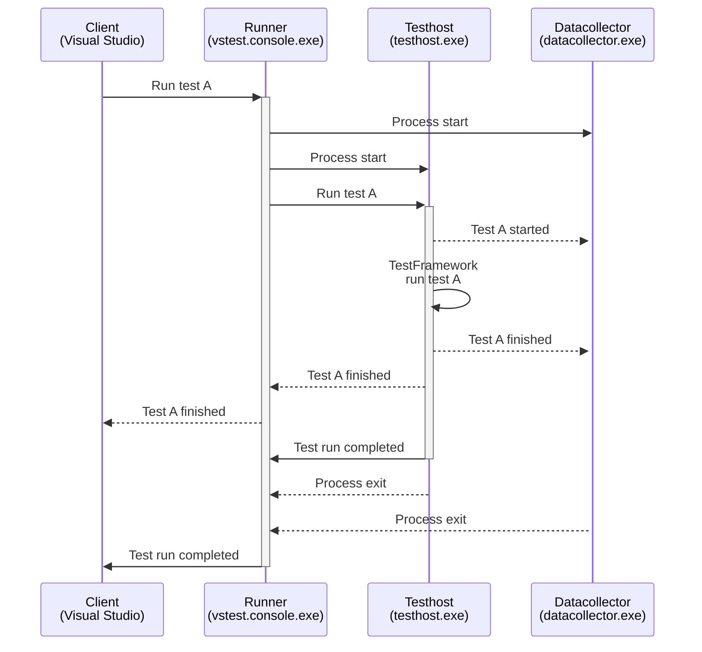
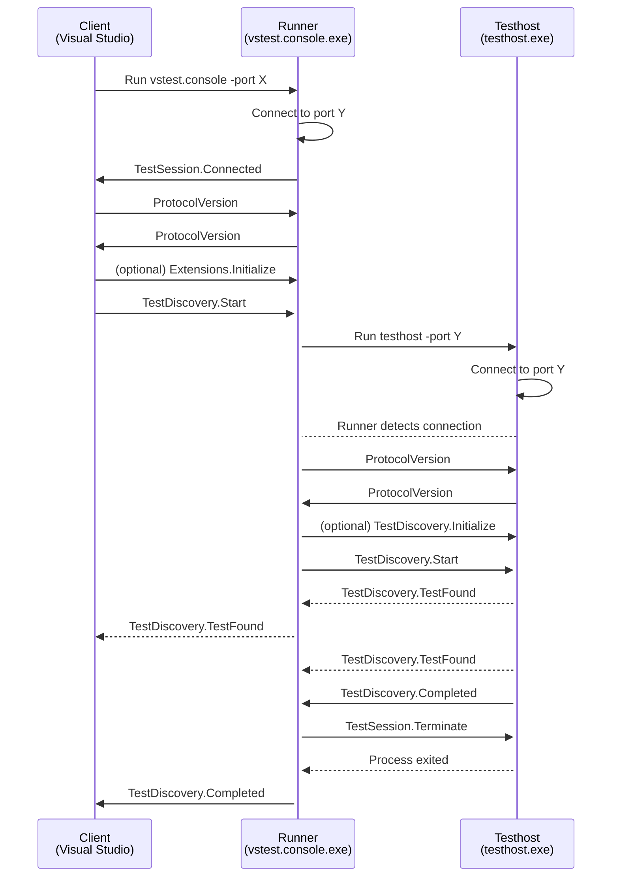

## What is TestPlatform? 

TestPlatform is a collection of libraries and tools that provide test running for Visual Studio Test Explorer, `dotnet test`, Azure DevOps, Omnisharp, Stryker and other tools.

TestPlatform is mainly focused on running C# tests, but it is an extensible platform, that allows additional providers and extensions to be used.

TestPlatform is also known as vstest, or by the names of the tools that use it: Test Explorer, and `dotnet test`.


## How it works?

TestPlatform consists of multiple processes that communicate over sockets, by sending JSON serialized messages. There are 4 processes that usually work together run tests:

- Client
- Runner
- Testhost
- Datacollector

The client is your IDE, or your command line. It determines what test needs to run, e.g. the one that the user clicked on in TestExplorer.

The runner receives the request from the client, and starts an appropriate testhost for the test.

Testhost receives the request to run tests, and runs them via an appropriate test framework. The most often used .NET test frameworks are XUnit, MSTest and NUnit.

Datacollector observes the testhost to collect additional information about the run.

While the tests execute, the results are reported back to the runner, aggregated, and forwarded to the client.

The client processes the results and shows them in their UI, for example as TestExplorer does it here: 

<TODO gif>

A simplified flow describing the whole process is as follows: 



This example represents the basic workflow of a test run. With each component having its own set of responsibilities:

- *Client* such as Visual Studio, is responsible for interfacing with the user, and presenting the results in user friendly way. A graphical Client is not part of TestPlatform.

- *Runner* is responsible for orchestrating one or more testhost processes to execute the given set of tests. The tests are not required to come from a single library, or to be targeting a single language.

- *Testhost* testhost is responsible for running tests from a single library (or source), and reporting the results. Testhost for .NET and .NET Framework comes with TestPlatform, but additional testhosts for other languages can be provided externally.

- *Datacollector* runs in additional process, and can host user extensions that observe testhost and manage its lifetime.


## Workflows

The Run workflow described above is very common in command line tools, and probably the first thing everyone thinks about when it comes to tests. There are additional workflows that TestPlatform provides:

- *Discovery* - discovers tests in given test sources, most commonly .NET dlls.
- *Run* - runs tests from given libraries (test sources) or from a given list of pre-discovered tests. 
- *Session* - starts the runner and waits for requests.
- *TestSession* - starts a set of testhosts for given test sources, to make the ready to run.
- *AttachmentProcessing* - processes a given set of attachments that were produced during a previous test run, e.g. merges code coverage files.


# Specification

## Base Protocol

### Header Part

### Content Part

### Base Types

### Request Message

### Response Message

### Notification Message

### Cancellation Support

### Progress Support

## Test Platform Protocol

TestPlatform protocol defines a set of JSON request, response and notification messages, that are exchanged using the above base protocol. This section starts by describing the basic JSON structures used in the protocol. The description uses C# classes, and types, with nullability enabled. Meaning that every type is non-nullable by default, and nullability is denoted by `?` following the type name.

<TODO example?>

The protocol assumes that one server serves one tool. There is no support in the protocol to share one server between different tools.

### Capabilities

The client, runner + datacollector, and testhost are shipped separately. Each of those components can have a different version and hence a different set of functionality they support. A single number (protocol version) is used to represent the whole set of capabilities that a given component supports. Each newer version includes complete functionality of the previous version. There are no granular capabilities.

Components are expected to handshake a version of the protocol to use, and use the highest version that is common to both sides.

> For example client announces that is supports version 7, runner supports 9, version 7 is used.

Once a version is agreed upon, a higher version should not be used by the lower level components. 

> The above runner should announce 7 to testhost, rather than 9. If testhost announces 10, 7 is used. 

The version is negotiated between the components at the beginning of every workflow using [ProtocolVersion](#protocolversion-request) request.

### Request, Notification and Response Ordering

The server supports processing only a single request at a time. Unless the request is [Cancel](#cancel) or [Abort](#abort) request.

All notifications are sent before as response is sent.

### Message documentation

TestPlatformProtocol is defined by a set of requests, responses and notifications. Each of those are described using the following format:

- a header describing the request
- a request section describing the format of the 

<TODO>

## Basic structures

### URI

### String type aliases

### Regular expressions

### Enumerations

### TestCase

### TestResult

### Message

## Lifecycle Messages

The current protocol specification defines that the lifecycle of a server is managed by the client (e.g. VisualStudio). It is up to the client to decide when to start (process-wise) and when to shutdown a server.

### ProtocolVersion request

Version request is sent as the first request from the client to runner, and from runner to testhost. This request is used to negotiate the version of protocol to be used.

Each protocol version is allowed to only add new features and never remove old features. Each component is also required to support all versions of protocol from version 0 up to the latest version. 

The handshake is one sided. The left side sends the request, and the right side (client-**runner**, or runner-**testhost**) responds with the determined version. 

The version is determined by choosing the highest common supported version. When client sends 6, and runner supports maximum version 7, then 6 will be used.

The receiving side should remember the agreed value, and use it as the highest supported version for any downstream component. In the case above runner should send 6 to testhost, even though the runner supports versions up to 7.

The request was introduced in TestPlatform version `16.0.0`. Runners before this version are not allowed. Testhosts before this version are allowed, the version of testhost if figured out by scanning the assembly, and the request is not sent to them. Version 0 is used for communication.

Versions: 

- 0: The original base protocol with no explicit versioning in the message. It is used during negotiation.
- 1: Added Version field to the base protocol.
- 2: Changed serialization from a generic bag that described each property and its type, to explicit properties that are serialized without additional type info.
- 3: Added AttachDebugger message.
- 4: Added because version 3 did not update the serialization to use, and it will use v1 serialization (bag) rather than explicit properties. Right side should avoid negotiating 3 and downgrade to 2.
- 5: Unknown. (TODO)
- 6: Added Abort and Cancel with handlers that report the status.
- 7: Latest version. (TODO)

*Request:*

```csharp
// Version from 0 to 7.
int
```

```json
{
    "MessageType":"ProtocolVersion",
    "Payload":7
}
```

*Response:*

```csharp
// Version from 0 to 7.
int
```

```json
{
    "MessageType":"ProtocolVersion",
    "Payload":7
}
```

### TestSession.Message notification

Downstream components can send messages to upstream components, with a given severity. This is mostly used to send additional information from extensions. Upstream component can decide what to do with the information, if it will process it and forward it, or batch it and then send it as one unified message. 

The upstream component should not parse the message content, or use it for flow control.

```csharp
// Message to send back to an upstream component to report
// a message with a given severity.
public class TestMessagePayload
{
    public TestMessageLevel MessageLevel { get; set; }

    public string? Message { get; set; }
}

public enum TestMessageLevel
{
    // Information only, can be safely ignored, 
    // usually on the sender side to avoid overhead 
    // of sending it.
    Informational = 0,
 
    Warning = 1,

    Error = 2
}
```

```json
{
    "Version": 7,
    "MessageType": "TestSession.Message",
    "Payload": {
        "MessageLevel": 0,
        "Message": "Logging TestHost Diagnostics in file: C:\\logs\\log.host.txt"
    }
}
```

## Session

Session starts the runner process, and connects to it. This is used in two ways. First as a way to pre-start Runner before there is any work for it, this is done for example by Visual Studio to have the runner ready to receive work. Or the flow is run just before other requests (e.g. Discovery).

> ⚠️ Do not confuse this with TestSession workflow that pre-starts testhosts.

### Runner start request

*Request:* 

The runner process starts.

*Response:*

```csharp
null
```

```json
{
    "MessageType": "TestSession.Connected",
    "Payload": null
}
```


```mermaid
participant c as Client<br>(Visual Studio)
participant r as Runner<br>(vstest.console.exe)
c->>r:   Run vstest.console -port X
r->>r:   Connect to port Y
r->>c:   TestSession.Connected
```

## Discovery

Discovery workflow is used to find tests in the provided test sources. Discovery happens in testhost and can run in parallel. Datacollectors are not used during discovery.

> ℹ️ The real work is often offloaded to a test framework such as NUnit, which runs inside of the testhost process. This is not shown in the workflow below.





## Run


