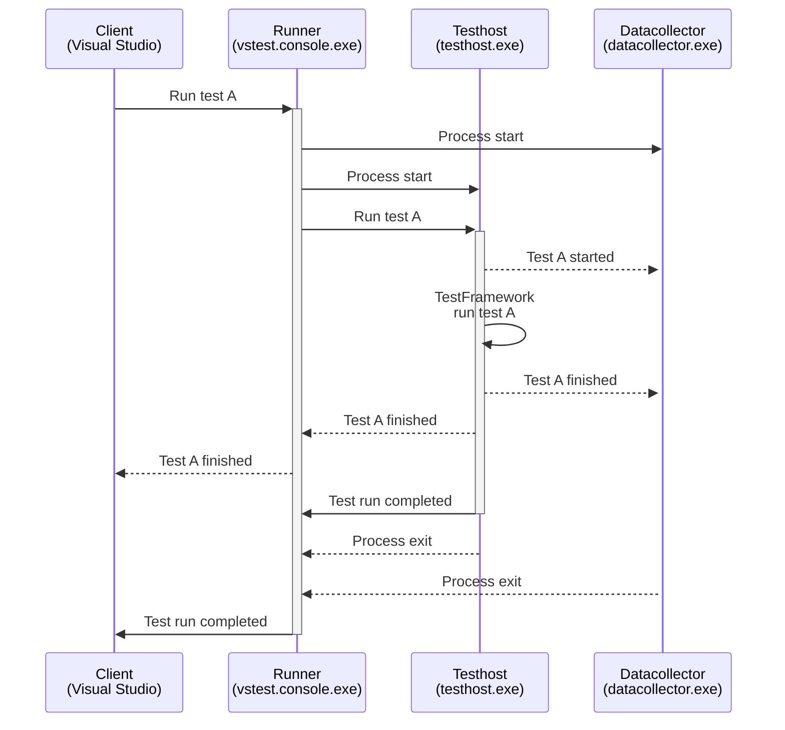
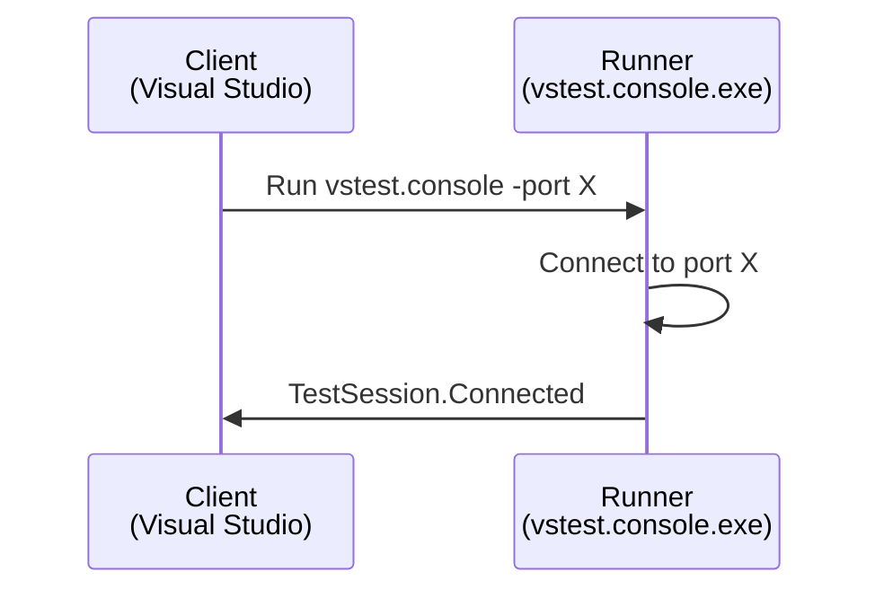
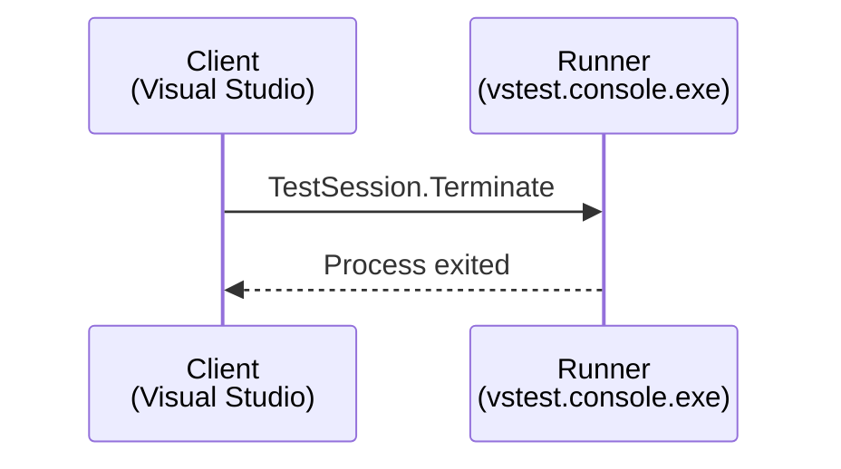
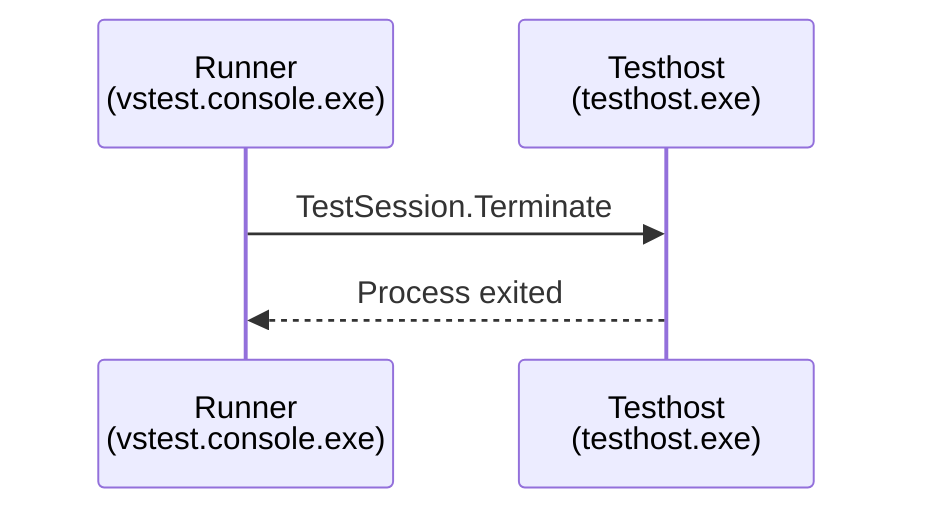
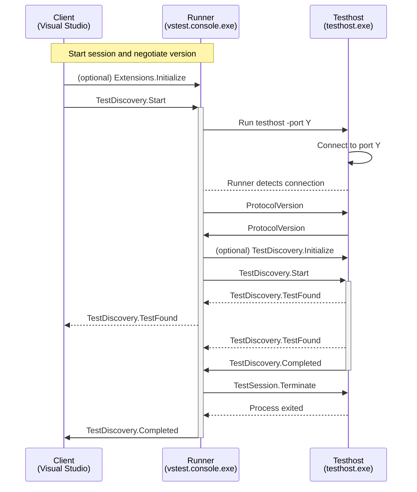
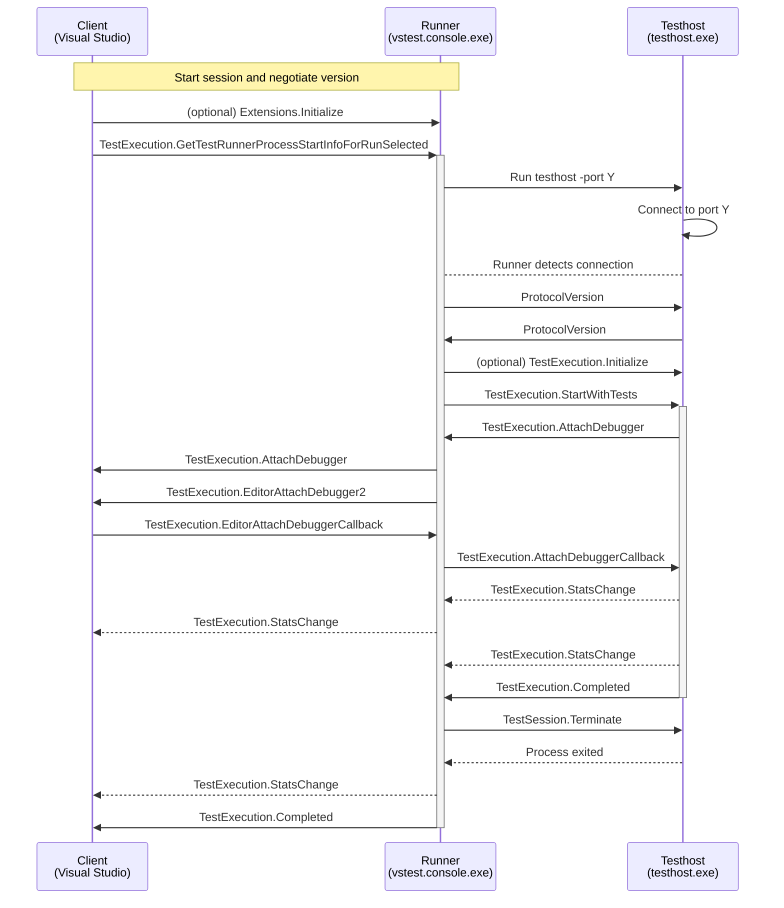

# Test Platform

- [Test Platform](#test-platform)
  - [What is TestPlatform?](#what-is-testplatform)
  - [How it works?](#how-it-works)
  - [Workflows](#workflows)
  - [Communication Protocol](#communication-protocol)
    - [Base Protocol](#base-protocol)
      - [Header Part](#header-part)
      - [Content Part](#content-part)
      - [Base Types](#base-types)
      - [Request Message](#request-message)
      - [Response Message](#response-message)
      - [Notification Message](#notification-message)
      - [Cancellation Support](#cancellation-support)
      - [Progress Support](#progress-support)
    - [Test Platform Protocol](#test-platform-protocol)
      - [Capabilities](#capabilities)
      - [Request, Notification and Response Ordering](#request-notification-and-response-ordering)
      - [Message documentation](#message-documentation)
    - [Basic structures](#basic-structures)
      - [URI](#uri)
      - [String type aliases](#string-type-aliases)
      - [Regular expressions](#regular-expressions)
      - [Enumerations](#enumerations)
      - [TestCase](#testcase)
      - [TestResult](#testresult)
      - [Message](#message)
    - [Lifecycle Messages](#lifecycle-messages)
      - [ProtocolVersion request](#protocolversion-request)
      - [TestSession.Message notification (Runner) (Testhost)](#testsessionmessage-notification-runner-testhost)
    - [Session](#session)
      - [Start Runner process request (Runner)](#start-runner-process-request-runner)
      - [TestSession.Terminate request (Runner)](#testsessionterminate-request-runner)
      - [Start Testhost process request (Runner)](#start-testhost-process-request-runner)
      - [Terminate testhost request (Testhost)](#terminate-testhost-request-testhost)
    - [Discovery](#discovery)
      - [Extensions.Initialize request (Runner)](#extensionsinitialize-request-runner)
      - [TestDiscovery.Start request (Runner)](#testdiscoverystart-request-runner)
      - [TestDiscovery.Initialize request (Testhost)](#testdiscoveryinitialize-request-testhost)
      - [TestDiscovery.Start request (Testhost)](#testdiscoverystart-request-testhost)
      - [TestDiscovery.TestFound notification (Testhost)](#testdiscoverytestfound-notification-testhost)
      - [TestDiscovery.TestFound notification (Runner)](#testdiscoverytestfound-notification-runner)
    - [Run](#run)
      - [TestExecution.GetTestRunnerProcessStartInfoForRunSelected request (Client)](#testexecutiongettestrunnerprocessstartinfoforrunselected-request-client)
      - [TestExecution.Initialize request (Runner)](#testexecutioninitialize-request-runner)
      - [TestExecution.StartWithTests (Runner)](#testexecutionstartwithtests-runner)
      - [TestExecution.StartWithSources](#testexecutionstartwithsources)
      - [TestExecution.StatsChange notification (Runner)](#testexecutionstatschange-notification-runner)
      - [TestExecution.StatsChange notification (Client)](#testexecutionstatschange-notification-client)
    - [Datacollection](#datacollection)
  - [Extensibility](#extensibility)
    - [DLL Extension points](#dll-extension-points)
      - [ObjectModel](#objectmodel)
      - [Test Adapter](#test-adapter)
      - [Test Logger](#test-logger)
      - [Runtime Provider](#runtime-provider)
    - [TranslationLayer extension points](#translationlayer-extension-points)
    - [.NET Implementation](#net-implementation)
      - [Architecture](#architecture)
      

## What is TestPlatform?

TestPlatform is a collection of libraries and tools that provide test running for Visual Studio Test Explorer, `dotnet test`, Azure DevOps, Omnisharp, Stryker and other tools.

TestPlatform is mainly focused on running C# tests, but it is an extensible platform, that allows additional providers and extensions to be used.

TestPlatform is also known as vstest, or by the names of the tools that use it: Test Explorer, and `dotnet test`.

## How it works?

TestPlatform consists of multiple processes that communicate over sockets, by sending JSON serialized messages. There are 4 processes that usually work together run tests:

- Client
- Runner
- Testhost
- Datacollector

The client is your IDE, or your command line. It determines what test needs to run, e.g. the one that the user clicked on in TestExplorer.

The runner receives the request from the client, and starts an appropriate testhost for the test.

Testhost receives the request to run tests, and runs them via an appropriate test framework. The most often used .NET test frameworks are XUnit, MSTest and NUnit.

Datacollector observes the testhost to collect additional information about the run.

While the tests execute, the results are reported back to the runner, aggregated, and forwarded to the client.

The client processes the results and shows them in their UI, for example as TestExplorer does it here:

<TODO gif>

A simplified flow describing the whole process is as follows:



This example represents the basic workflow of a test run. With each component having its own set of responsibilities:

- *Client* such as Visual Studio, is responsible for interfacing with the user, and presenting the results in user friendly way. A graphical Client is not part of TestPlatform.

- *Runner* is responsible for orchestrating one or more testhost processes to execute the given set of tests. The tests are not required to come from a single library, or to be targeting a single language.

- *Testhost* testhost is responsible for running tests from a single library (or source), and reporting the results. Testhost for .NET and .NET Framework comes with TestPlatform, but additional testhosts for other languages can be provided externally.

- *Datacollector* runs in additional process, and can host user extensions that observe testhost and manage its lifetime.

## Workflows

The Run workflow described above is very common in command line tools, and probably the first thing everyone thinks about when it comes to tests. There are additional workflows that TestPlatform provides:

- *Discovery* - discovers tests in given test sources, most commonly .NET dlls.
- *Run* - runs tests from given libraries (test sources) or from a given list of pre-discovered tests.
- *Session* - starts the runner and waits for requests.
- *TestSession* - starts a set of testhosts for given test sources, to make the ready to run.
- *AttachmentProcessing* - processes a given set of attachments that were produced during a previous test run, e.g. merges code coverage files.

## Communication Protocol

### Base Protocol

TODO: fill in more details.

Data are passed as JSON serialized strings over TCP. The messages are serialized using binary format that delimits messages by a length prefix. The size prefix is written as 7 bit encoded int. (The basics of encoding that number are summarized here: <https://stackoverflow.com/a/49780224/3065397>).

In .NET the data are written using BinaryWriter and BinaryReader which do all the needed conversions automatically when writing and reading the string (<https://learn.microsoft.com/en-us/dotnet/api/system.io.binarywriter.write?view=net-6.0#system-io-binarywriter-write(system-string>)).

The message on the wire is prefixed by the header, and read until the size of the message is reached. The 10 first bytes of a 1024 letter message looks like this:

```bash
128
08
72 - H
101 - e
108 - l
108 - l
111 - o
32
102 - f
114 - r
```

You can play with it using this code:

```cs
namespace ConsoleApp45
{
    internal class Program
    {
        static void Main(string[] args)
        {
            var mem = new MemoryStream();
            var w = new BinaryWriter(mem);
            var message = "Hello from TestPlatform!" + new string('*', 1000);

            Console.WriteLine($"Written length: {message.Length}");
            w.Write(message);
            w.Flush();

            var r = new BinaryReader(mem);
            mem.Position = 0;
            var length = r.Read7BitEncodedInt();
            Console.WriteLine($"Read length: {message.Length}");
            
            mem.Position = 0;
            var size = 10;
            var bytes = r.ReadBytes(size);
            Console.WriteLine($"Data (first {size} bytes):");
            Console.WriteLine(string.Join("\n", bytes.Select(ToText).ToArray()));
        }

        public static string ToText(byte b)
        {
            if (char.IsLetterOrDigit((char)b))
            {
                return $"{b:d2} - {(char)b}";
            }

            return $"{b:d2}";
        }
    }
}
```

The messages are then transported over TCP. In .NET the standard TCP client and TCP server is used. A single *dynamic* port is used for a single pair of client and server. (Unlike in a more typical web scenario where server has a determined port, and a client connects to that port.)

The role of client and server are not fully set, and based on parameters either the runner, or the testhost can serve the role of a server. Typically the runner is the server (setups a dynamic port, and starts testhost, passing the port to connect to). But in remote scenarios it is beneficial to make the remote side (testhost), the server, and open the port on the remote device which is more likely to be for-testing-only, and deprovisioned after the test run. In this case the server (testhost) needs to use a predetermined port which it sets up, and the client (runner) will connect to it.

#### Header Part

There is no header in the message itself. There is header only in the binary message.

#### Content Part

#### Base Types

#### Request Message

#### Response Message

#### Notification Message

#### Cancellation Support

#### Progress Support

### Test Platform Protocol

TestPlatform protocol defines a set of JSON request, response and notification messages, that are exchanged using the above base protocol. This section starts by describing the basic JSON structures used in the protocol. The description uses C# classes, and types, with nullability enabled. Meaning that every type is non-nullable by default, and nullability is denoted by `?` following the type name.

<TODO example?>

The protocol assumes that one server serves one tool. There is no support in the protocol to share one server between different tools.

#### Capabilities

The client, runner + datacollector, and testhost are shipped separately. Each of those components can have a different version and hence a different set of functionality they support. A single number (protocol version) is used to represent the whole set of capabilities that a given component supports. Each newer version includes complete functionality of the previous version. There are no granular capabilities.

Components are expected to handshake a version of the protocol to use, and use the highest version that is common to both sides.

> For example client announces that is supports version 7, runner supports 9, version 7 is used.

Once a version is agreed upon, a higher version should not be used by the lower level components.

> The above runner should announce 7 to testhost, rather than 9. If testhost announces 10, 7 is used.

The version is negotiated between the components at the beginning of every workflow using [ProtocolVersion](#protocolversion-request) request.

#### Request, Notification and Response Ordering

The server supports processing only a single request at a time. Unless the request is [Cancel](#cancel) or [Abort](#abort) request.

All notifications are sent before a response is sent.

#### Message documentation

TestPlatformProtocol is defined by a set of requests, responses and notifications. Each of those are described using the following format:

- a header describing the request
- a request section describing the format of the

<TODO>

### Basic structures

#### URI

#### String type aliases

#### Regular expressions

#### Enumerations

#### TestCase

#### TestResult

#### Message

### Lifecycle Messages

The current protocol specification defines that the lifecycle of a server is managed by the client (e.g. VisualStudio). It is up to the client to decide when to start (process-wise) and when to shutdown a server.

#### ProtocolVersion request

Version request is sent as the first request from the client to runner, and from runner to testhost. This request is used to negotiate the version of protocol to be used.

Each protocol version is allowed to only add new features and never remove old features. Each component is also required to support all versions of protocol from version 0 up to the latest version.

The handshake is one sided. The left side sends the request, and the right side (client-**runner**, or runner-**testhost**) responds with the determined version.

The version is determined by choosing the highest common supported version. When client sends 6, and runner supports maximum version 7, then 6 will be used.

The receiving side should remember the agreed value, and use it as the highest supported version for any downstream component. In the case above runner should send 6 to testhost, even though the runner supports versions up to 7.

The request was introduced in TestPlatform version `16.0.0`. Runners before this version are not allowed. Testhosts before this version are allowed, the version of testhost is figured out by scanning the assembly, and the request is not sent to them. Version 0 is used for communication.

Versions:

- 0: The original base protocol with no explicit versioning in the message. It is used during negotiation.
- 1: Added Version field to the base protocol.
- 2: Changed serialization from a generic bag that described each property and its type, to explicit properties that are serialized without additional type info.
- 3: Added AttachDebugger message.
- 4: Added because version 3 did not update the serialization to use, and it will use v1 serialization (bag) rather than explicit properties. Right side should avoid negotiating 3 and downgrade to 2.
- 5: Unknown. (TODO)
- 6: Added Abort and Cancel with handlers that report the status.
- 7: Added SkippedDiscoveredSources.

*Request:*

```csharp
// Version from 0 to 7.
int version
```

```json
{
    "MessageType":"ProtocolVersion",
    "Payload":7
}
```

*Response:*

```csharp
// Version from 0 to 7.
int version
```

```json
{
    "MessageType":"ProtocolVersion",
    "Payload":7
}
```

#### TestSession.Message notification (Runner) (Testhost)

Downstream components can send messages to upstream components, with a given severity. This is mostly used to send additional information from extensions. Upstream component can decide what to do with the information, if it will process it and forward it, or batch it and then send it as one unified message.

The upstream component should not parse the message content, or use it for flow control.

```csharp
// Message to send back to an upstream component to report
// a message with a given severity.
public class TestMessagePayload
{
    public TestMessageLevel MessageLevel { get; set; }

    public string? Message { get; set; }
}

public enum TestMessageLevel
{
    // Information only, can be safely ignored, 
    // usually on the sender side to avoid overhead 
    // of sending it.
    Informational = 0,
 
    Warning = 1,

    Error = 2
}
```

```json
{
    "Version": 7,
    "MessageType": "TestSession.Message",
    "Payload": {
        "MessageLevel": 0,
        "Message": "Logging TestHost Diagnostics in file: C:\\logs\\log.host.txt"
    }
}
```

### Session

Session starts the runner process, and connects to it. This is used in two ways. First as a way to pre-start Runner before there is any work for it, this is done for example by Visual Studio to have the runner ready to receive work. Or the flow is run just before other requests (e.g. Discovery).

> ⚠️ Do not confuse this with TestSession workflow that pre-starts testhosts.

#### Start Runner process request (Runner)

Runner process starts and sends response to the port that it connected to.



*Request:*

The runner process starts.

*Response:*

```csharp
null
```

```json
{
    "MessageType": "TestSession.Connected",
    "Payload": null
}
```

#### TestSession.Terminate request (Runner)

Runner process is asked to terminate.



*Request:*

```csharp
null
```

```json
{
    "MessageType": "TestSession.Terminate",
    "Payload": null
}
```

*Response:*

The runner process terminates. Termination is detected by observing the process. ([Exited](https://learn.microsoft.com/dotnet/api/system.diagnostics.process.exited) event in .NET.)

#### Start Testhost process request (Runner)

Testhost process starts, and runner detects that it connected. There is no additional request response exchange.

Same applies to datacollector.

#### Terminate testhost request (Testhost)

Testhost process is asked to terminate.



*Request:*

```csharp
null
```

```json
{
    "MessageType": "TestSession.Terminate",
    "Payload": null
}
```

*Response:*

The testhost process terminates. Termination is detected by observing the process. ([Exited](https://learn.microsoft.com/dotnet/api/system.diagnostics.process.exited) event in .NET.)

Same applies to datacollector.

### Discovery

Discovery workflow is used to find tests in the provided test sources. Discovery happens in testhost and can run in parallel. Datacollectors are not used during discovery.

> ℹ️ The real work is often offloaded to a test framework such as NUnit, which runs inside of the testhost process. This is not shown in the workflow below.



#### Extensions.Initialize request (Runner)

List of extensions to initialize in runner. Runner should forward appropriate extensions to testhost or datacollector if they are appropriate. For example when then list contains test adapters. This request is optional.

*Request:*

```cs
// Full path to zero or more extensions to initialize.
// Most often those are .NET .dll files, but can also be VSIX extensions.
IEnumerable<string> extensions
```

```json
{
    "Version": 7,
    "MessageType": "Extensions.Initialize",
    "Payload": [
        "C:\\PROGRAM FILES\\MICROSOFT VISUAL STUDIO\\2022\\INTPREVIEW\\COMMON7\\IDE\\COMMONEXTENSIONS\\MICROSOFT\\EBF\\TESTEXPLORER\\Microsoft.VisualStudio.Workspace.ExternalBuildFramework.TestProvider.dll",
        "C:\\Users\\me\\.nuget\\packages\\mstest.testadapter\\2.2.8\\build\\_common\\Microsoft.VisualStudio.TestPlatform.MSTest.TestAdapter.dll"
    ]
}
```

*Response:*

None.

#### TestDiscovery.Start request (Runner)

Contains full paths to one or more test sources, and settings to use for the discovery. Runner can split the request into multiple additional pieces. For example when the sources are incompatible and each need a different type of testhost. Or when it is asked to discover the sources in parallel.

*Request:*

```csharp
public class DiscoveryRequestPayload
{
    // Full paths to sources to be discovered.
    public IEnumerable<string>? Sources { get; set; }

    // Settings used for this discovery request.
    [DataMember]
    public string? RunSettings { get; set; }

    // TestPlatformOptions to use for this request.
    public TestPlatformOptions? TestPlatformOptions
    {
        get;
        set;
    }

    // A set of pre-started testhosts that this request should use.
    public TestSessionInfo? TestSessionInfo { get; set; }
}
```

```json
{
    "Version": 7,
    "MessageType": "TestDiscovery.Start",
    "Payload": {
        "Sources": [
            "S:\\p\\vstest\\playground\\MSTest1\\bin\\Debug\\net472\\MSTest1.dll"
        ],
        "RunSettings": "<RunSettings></RunSettings>",
        "TestPlatformOptions": {
            "TestCaseFilter": null,
            "FilterOptions": null,
            "CollectMetrics": true,
            "SkipDefaultAdapters": false
        },
        "TestSessionInfo": null
    }
}
```

*Response:*

```cs
public class DiscoveryCompletePayload
{
    //  Total number of tests discovered in this request. Set to -1 when aborted.
    public long TotalTests { get; set; }

    // The last set of tests that were not reported yet by TestFound message.
    public IEnumerable<TestCase>? LastDiscoveredTests { get; set; }

    // Specifies if discovery has been aborted (meaning that testhost crashed or was killed). 
    // If true TotalCount is also set to -1.
    public bool IsAborted { get; set; }

    // Telemetry.
    public IDictionary<string, object>? Metrics { get; set; }

    // Sources which were fully discovered.
    public IList<string>? FullyDiscoveredSources { get; set; } = new List<string>();

    // Sources which were partially discovered (e.g. started discovering tests, but then discovery aborted).
    // Since protocol 6.
    public IList<string>? PartiallyDiscoveredSources { get; set; } = new List<string>();

    // Sources that were skipped during discovery.
    // Since protocol 7.
    public IList<string>? SkippedDiscoverySources { get; set; } = new List<string>();

    // Sources which were not discovered at all.
    // Since protocol 6.
    public IList<string>? NotDiscoveredSources { get; set; } = new List<string>();

    // Gets or sets the collection of discovered extensions.
    // TODO: since?
    public Dictionary<string, HashSet<string>>? DiscoveredExtensions { get; set; } = new();
}
```

```json
{
    "Version": 7,
    "MessageType": "TestDiscovery.Completed",
    "Payload": {
        "TotalTests": 3,
        "LastDiscoveredTests": null,
        "IsAborted": false,
        "Metrics": {
            "VS.TestDiscovery.TimeTakenAdapter.executor://mstestadapter/v2": 0.38184969999999996,
            "VS.TestDiscovery.TimeTakenInSecByAllAdapters": 0.38184969999999996,
            "VS.TestDiscovery.TotalTestsDiscovered.executor://mstestadapter/v2": 3.0,
            "VS.TestDiscovery.TotalTests": 3.0,
            "VS.TestDiscovery.TimeTakenToLoadAdaptersInSec": 0.0030006,
            "VS.TestDiscovery.AdaptersDiscoveredCount": 1,
            "VS.TestDiscovery.AdaptersUsedCount": 1,
            "VS.TestRun.TargetFramework": ".NETFramework,Version=v4.7.2",
            "VS.TestRun.TargetPlatform": "X64",
            "VS.TestRun.MaxCPUcount": 1,
            "VS.TestRun.TargetDevice": "Local Machine",
            "VS.TestRun.TestPlatformVersion": "17.5.0-dev",
            "VS.TestRun.TargetOS": "Microsoft Windows NT 10.0.22623.0",
            "VS.TestRun.DisableAppDomain": false,
            "VS.TestRun.CommandLineSwitches": "",
            "VS.TestRun.LoggersUsed": "",
            "VS.TestDiscovery.ParallelEnabled": "False",
            "VS.TestSession.Id": "",
            "VS.TestDiscovery.NumberOfSources": 1,
            "VS.TestDiscovery.DiscoveryState": "Completed",
            "VS.TestDiscovery.TotalTimeTakenInSec": 4.4026146,
            "VS.TestPlatform.DiscoveredExtensions": "{\"TestDiscoverers\":[\"Microsoft.VisualStudio.TestPlatform.MSTest.TestAdapter.MSTestDiscoverer, Microsoft.VisualStudio.TestPlatform.MSTest.TestAdapter, Version=14.0.0.0, Culture=neutral, PublicKeyToken=b03f5f7f11d50a3a\"],\"TestHosts\":[\"HostProvider://DefaultTestHost\",\"HostProvider://DotnetTestHost\"]}"
        },
        "FullyDiscoveredSources": [
            "S:\\p\\vstest\\playground\\MSTest1\\bin\\Debug\\net472\\MSTest1.dll"
        ],
        "PartiallyDiscoveredSources": [],
        "NotDiscoveredSources": [],
        "SkippedDiscoverySources": [],
        "DiscoveredExtensions": {
            "TestDiscoverers": [
                "Microsoft.VisualStudio.TestPlatform.MSTest.TestAdapter.MSTestDiscoverer, Microsoft.VisualStudio.TestPlatform.MSTest.TestAdapter, Version=14.0.0.0, Culture=neutral, PublicKeyToken=b03f5f7f11d50a3a"
            ],
            "TestHosts": [
                "HostProvider://DefaultTestHost",
                "HostProvider://DotnetTestHost"
            ]
        }
    }
}
```

#### TestDiscovery.Initialize request (Testhost)

List of extensions to initialize in the testhost. This request is optional.

*Request:*

```cs
// Full path to zero or more extensions to initialize.
// Most often those are .NET .dll files, but can also be VSIX extensions.
IEnumerable<string> extensions
```

```json
{
    "Version": 7,
    "MessageType": "TestDiscovery.Initialize",
    "Payload": [
        "S:\\p\\vstest\\playground\\MSTest1\\bin\\Debug\\net472\\Microsoft.VisualStudio.TestPlatform.MSTest.TestAdapter.dll"
    ]
}
```

*Response:*

None.

#### TestDiscovery.Start request (Testhost)

Contains full paths to one or more test sources, and settings to use for the discovery. Runner can split the request into multiple additional pieces. For example when the sources are incompatible and each need a different type of testhost. Or when it is asked to discover the sources in parallel.

*Request:*

```csharp
public class DiscoveryCriteria
{
    // Gets the test Containers (e.g. .appx, .appxrecipie) TODO what???
    public string? Package { get; set; }

    
    // Test adapter mapped to the sources it should process. "_none_" is used when there 
    // is no adapter determined.
    public Dictionary<string, IEnumerable<string>> AdapterSourceMap { get; private set; }

    
    // Discovered test event will be raised after discovering at minimum this number of tests, 
    // or when DiscoveredTestEventTimeout is passed. This helps batching the results, making communication between processes faster.
    public long FrequencyOfDiscoveredTestsEvent { get; private set; }

    // Discovered test event will be raised after this much time since last test
    // when FrequencyOfDiscoveredTestsEvent is passed. This helps sending the batches more frequently, 
    // when the batch is large, but there is small amount of tests, or the discovery is slow. Giving more frequent feedback to user.
    public TimeSpan DiscoveredTestEventTimeout { get; private set; }

    // Run settings for the discovery.
    public string? RunSettings { get; private set; }

    // Filters out tests that don't meet this filter. Filter is test framework
    // dependent.
    public string? TestCaseFilter { get; set; }

    // TestSession (pre-started testhosts) on which this discovery should happen.
    public TestSessionInfo? TestSessionInfo { get; set; }
}
```

```json
{
    "Version": 7,
    "MessageType": "TestDiscovery.Start",
    "Payload": {
        "Package": null,
        "AdapterSourceMap": {
            "_none_": [
                "S:\\p\\vstest\\playground\\MSTest1\\bin\\Debug\\net472\\MSTest1.dll"
            ]
        },
        "FrequencyOfDiscoveredTestsEvent": 10,
        "DiscoveredTestEventTimeout": "00:00:01.5000000",
        "RunSettings": "<RunSettings></RunSettings>",
        "TestCaseFilter": null,
        "TestSessionInfo": null
    }
}
```

*Response:*

```cs
public class DiscoveryCompletePayload
{
    //  Total number of tests discovered in this request. Set to -1 when aborted.
    public long TotalTests { get; set; }

    // The last set of tests that were not reported yet by TestFound message.
    public IEnumerable<TestCase>? LastDiscoveredTests { get; set; }

    // Specifies if discovery has been aborted (meaning that testhost crashed or was killed). 
    // If true TotalCount is also set to -1.
    public bool IsAborted { get; set; }

    // Telemetry.
    public IDictionary<string, object>? Metrics { get; set; }

    // Sources which were fully discovered.
    public IList<string>? FullyDiscoveredSources { get; set; } = new List<string>();

    // Sources which were partially discovered (e.g. started discovering tests, but then discovery aborted).
    // Since protocol 6.
    public IList<string>? PartiallyDiscoveredSources { get; set; } = new List<string>();

    // Sources that were skipped during discovery.
    // Since protocol 7.
    public IList<string>? SkippedDiscoverySources { get; set; } = new List<string>();

    // Sources which were not discovered at all.
    // Since protocol 6.
    public IList<string>? NotDiscoveredSources { get; set; } = new List<string>();

    // Gets or sets the collection of discovered extensions.
    // TODO: since?
    public Dictionary<string, HashSet<string>>? DiscoveredExtensions { get; set; } = new();
}
```

```json
{
    "Version": 7,
    "MessageType": "TestDiscovery.Completed",
    "Payload": {
        "TotalTests": 2,
        "LastDiscoveredTests": [],
        "IsAborted": false,
        "Metrics": {
            "VS.TestDiscovery.TimeTakenToLoadAdaptersInSec": 0.0045024999999999996,
            "VS.TestDiscovery.AdaptersDiscoveredCount": 1,
            "VS.TestDiscovery.TotalTestsDiscovered.executor://mstestadapter/v2": 2,
            "VS.TestDiscovery.TimeTakenAdapter.executor://mstestadapter/v2": 0.2842144,
            "VS.TestDiscovery.TimeTakenInSecByAllAdapters": 0.2842144,
            "VS.TestDiscovery.AdaptersUsedCount": 1.0,
            "VS.TestDiscovery.DiscoveryState": "Completed",
            "VS.TestDiscovery.TotalTests": 2
        },
        "FullyDiscoveredSources": [
            "S:\\p\\vstest\\playground\\MSTest1\\bin\\Debug\\net472\\MSTest1.dll"
        ],
        "PartiallyDiscoveredSources": [],
        "NotDiscoveredSources": [],
        "SkippedDiscoverySources": [],
        "DiscoveredExtensions": {
            "TestDiscoverers": [
                "Microsoft.VisualStudio.TestPlatform.MSTest.TestAdapter.MSTestDiscoverer, Microsoft.VisualStudio.TestPlatform.MSTest.TestAdapter, Version=14.0.0.0, Culture=neutral, PublicKeyToken=b03f5f7f11d50a3a"
            ],
            "TestSettingsProviders": []
        }
    }
}
```

#### TestDiscovery.TestFound notification (Testhost)

Contains a batch of tests that were found. Runner should aggregate the results, and hold onto them if it needs. The final response does not contain all the partial updates.

```cs
IEnumerable<TestCase> testCases
```

```json
{
    "Version": 7,
    "MessageType": "TestDiscovery.TestFound",
    "Payload": [
        {
            "Id": "cfa76bee-59fb-2133-3c23-9693a1078027",
            "FullyQualifiedName": "MSTest1.UnitTest1.TestMethod1",
            "DisplayName": "TestMethod1",
            "ExecutorUri": "executor://MSTestAdapter/v2",
            "Source": "S:\\p\\vstest\\playground\\MSTest1\\bin\\Debug\\net472\\MSTest1.dll",
            "CodeFilePath": null,
            "LineNumber": -1,
            "Properties": [
                {
                    "Key": {
                        "Id": "MSTestDiscoverer.TestClassName",
                        "Label": "ClassName",
                        "Category": "",
                        "Description": "",
                        "Attributes": 1,
                        "ValueType": "System.String"
                    },
                    "Value": "MSTest1.UnitTest1"
                },
                {
                    "Key": {
                        "Id": "TestObject.Traits",
                        "Label": "Traits",
                        "Category": "",
                        "Description": "",
                        "Attributes": 5,
                        "ValueType": "System.Collections.Generic.KeyValuePair`2[[System.String],[System.String]][]"
                    },
                    "Value": []
                }
            ]
        }
    ]
}
```

#### TestDiscovery.TestFound notification (Runner)

Contains a batch of tests that were found. Client should aggregate the results, and hold onto them if it needs. The final response does not contain all the partial updates.

```cs
IEnumerable<TestCase> testCases
```

```json
{
    "Version": 7,
    "MessageType": "TestDiscovery.TestFound",
    "Payload": [
        {
            "Id": "cfa76bee-59fb-2133-3c23-9693a1078027",
            "FullyQualifiedName": "MSTest1.UnitTest1.TestMethod1",
            "DisplayName": "TestMethod1",
            "ExecutorUri": "executor://MSTestAdapter/v2",
            "Source": "S:\\p\\vstest\\playground\\MSTest1\\bin\\Debug\\net472\\MSTest1.dll",
            "CodeFilePath": null,
            "LineNumber": -1,
            "Properties": [
                {
                    "Key": {
                        "Id": "MSTestDiscoverer.TestClassName",
                        "Label": "ClassName",
                        "Category": "",
                        "Description": "",
                        "Attributes": 1,
                        "ValueType": "System.String"
                    },
                    "Value": "MSTest1.UnitTest1"
                },
                {
                    "Key": {
                        "Id": "TestObject.Traits",
                        "Label": "Traits",
                        "Category": "",
                        "Description": "",
                        "Attributes": 5,
                        "ValueType": "System.Collections.Generic.KeyValuePair`2[[System.String],[System.String]][]"
                    },
                    "Value": []
                }
            ]
        }
    ]
}
```

### Run

The Run workflow runs the provided tests. It has has four modes, determined by combination of two properties. Running with sources, or set of discovered tests. And running with a default testhost launcher, or with a custom testhost launcher. Running with custom testhost launcher is most commonly used when debugging, and it adds the debugger related messages into the workflow.

There are four distinct messages, one for each mode, which all use the same payload:

- TestExecution.RunAllWithDefaultHost (sources, default testhost)
- TestExecution.RunSelectedWithDefaultHost (tests, default testhost)
- TestExecution.GetTestRunnerProcessStartInfoForRunAll (sources, custom testhost)
- TestExecution.GetTestRunnerProcessStartInfoForRunSelected (tests, custom testhost)

Below, only the most complex workflow is shown:



#### TestExecution.GetTestRunnerProcessStartInfoForRunSelected request (Client)

This applies to all these four requests:

- TestExecution.RunAllWithDefaultHost (sources, default testhost)
- TestExecution.RunSelectedWithDefaultHost (tests, default testhost)
- TestExecution.GetTestRunnerProcessStartInfoForRunAll (sources, custom testhost)
- TestExecution.GetTestRunnerProcessStartInfoForRunSelected (tests, custom testhost)

*Request:*

```cs
public class TestRunRequestPayload
{
    // Full paths of to the test sources containing the tests to run.
    // It should not be used together with TestCases.
    public List<string>? Sources { get; set; }

    // List of TestCases that were previously discovered.
    // It should not be used together with Sources.
    public List<TestCase>? TestCases { get; set; }

    // RunSettings for the current run.
    public string? RunSettings { get; set; }

    // True if the runner should stay alive after the run is completed.
    public bool KeepAlive { get; set; }

    // True when requests to attach debugger to testhost should be send back to client.
    public bool DebuggingEnabled { get; set; }

    // Test platform options.
    public TestPlatformOptions? TestPlatformOptions { get; set; }

    // The set of pre-started testhosts on which this run should try to run.
    public TestSessionInfo? TestSessionInfo { get; set; }
}
```

```json
{
   "Version": 7,
   "MessageType": "TestExecution.GetTestRunnerProcessStartInfoForRunSelected",
   "Payload": {
      "Sources": null,
      "TestCases": [
         {
            "Id": "cfa76bee-59fb-2133-3c23-9693a1078027",
            "FullyQualifiedName": "MSTest1.UnitTest1.TestMethod1",
            "DisplayName": "TestMethod1",
            "ExecutorUri": "executor://MSTestAdapter/v2",
            "Source": "S:\\p\\vstest\\playground\\MSTest1\\bin\\Debug\\net472\\MSTest1.dll",
            "CodeFilePath": null,
            "LineNumber": -1,
            "Properties": [
               {
                  "Key": {
                     "Id": "MSTestDiscoverer.TestClassName",
                     "Label": "ClassName",
                     "Category": "",
                     "Description": "",
                     "Attributes": 1,
                     "ValueType": "System.String"
                  },
                  "Value": "MSTest1.UnitTest1"
               },
               {
                  "Key": {
                     "Id": "TestObject.Traits",
                     "Label": "Traits",
                     "Category": "",
                     "Description": "",
                     "Attributes": 5,
                     "ValueType": "System.Collections.Generic.KeyValuePair`2[[System.String],[System.String]][]"
                  },
                  "Value": []
               }
            ]
         }
      ],
      "RunSettings": "<RunSettings></RunSettings>",
      "KeepAlive": false,
      "DebuggingEnabled": true,
      "TestPlatformOptions": {
         "TestCaseFilter": null,
         "FilterOptions": null,
         "CollectMetrics": true,
         "SkipDefaultAdapters": false
      },
      "TestSessionInfo": null
   }
}
```

*Response:*

```cs
public class TestRunCompletePayload
{
    // The completion information defined below.
    public TestRunCompleteEventArgs? TestRunCompleteArgs { get; set; }

    // The last batch of tests that were executed, empty when they were sent 
    // via stats update message.
    public TestRunChangedEventArgs? LastRunTests { get; set; }

    // Gets or sets the run attachments, such as TRX reports or other files.
    public ICollection<AttachmentSet>? RunAttachments { get; set; }

    // Gets or sets the executor uris that were used to run the tests.
    public ICollection<string>? ExecutorUris { get; set; }
}

public class TestRunCompleteEventArgs
{
    // Gets the statistics on the state of the test run. Including how many tests 
    // were there for each outcome.
    public ITestRunStatistics? TestRunStatistics { get; private set; }

    // True when the run was cancelled. E.g. by user clicking cancel in a client
    // or starting a new RunTests operation.
    public bool IsCanceled { get; private set; }

    // Gets a value indicating whether the test run is aborted. Meaning that the testhost
    // crashed and runner sends this result on its behalf.
    public bool IsAborted { get; private set; }

    // Error encountered in the run that is not linked to any test.
    public Exception? Error { get; private set; }

    // Gets the attachment sets associated with the test run.
    // TODO: HOW is this different from RunAttachments above?
    public Collection<AttachmentSet> AttachmentSets { get; private set; }

    // Gets the invoked data collectors for the test session.
    public Collection<InvokedDataCollector> InvokedDataCollectors { get; private set; }

    // Gets the time elapsed in just running the tests.
    // Value is set to TimeSpan.Zero in case of any error.
    public TimeSpan ElapsedTimeInRunningTests { get; private set; }

    // Telemetry.
    public IDictionary<string, object>? Metrics { get; set; }

    // Extensions that were discovered in this run.
    public Dictionary<string, HashSet<string>>? DiscoveredExtensions { get; set; }
}
```

```json
{
   "Version": 7,
   "MessageType": "TestExecution.Completed",
   "Payload": {
      "TestRunCompleteArgs": {
         "TestRunStatistics": {
            "ExecutedTests": 3,
            "Stats": {
               "Passed": 3
            }
         },
         "IsCanceled": false,
         "IsAborted": false,
         "Error": null,
         "AttachmentSets": [],
         "InvokedDataCollectors": [],
         "ElapsedTimeInRunningTests": "00:00:00.5860000",
         "Metrics": {
            "VS.TestRun.TotalTestsRun.executor://mstestadapter/v2": 3.0,
            "VS.TestRun.AdaptersUsedCount": 1,
            "VS.TestRun.TimeTakenByAllAdapters": 0.5498061,
            "VS.TestRun.AdaptersDiscoveredCount": 1,
            "VS.TestRun.TotalTests": 3.0,
            "VS.TestRun.TimeTakenToRun.executor://mstestadapter/v2": 0.5498061,
            "VS.TestRun.TargetFramework": ".NETFramework,Version=v4.7.2",
            "VS.TestRun.TargetPlatform": "X64",
            "VS.TestRun.MaxCPUcount": 1,
            "VS.TestRun.TargetDevice": "Local Machine",
            "VS.TestRun.TestPlatformVersion": "17.5.0-dev",
            "VS.TestRun.TargetOS": "Microsoft Windows NT 10.0.22623.0",
            "VS.TestRun.DisableAppDomain": false,
            "VS.TestRun.CommandLineSwitches": "",
            "VS.TestRun.IsTestSettingsUsed": false,
            "VS.TestRun.LoggersUsed": "",
            "VS.TestRun.ParallelEnabled": "False",
            "VS.TestSession.Id": "",
            "VS.TestRun.NumberOfSources": 0,
            "VS.TestRun.RunState": "Completed",
            "VS.TestRun.TimeTakenInSec": 2.8273251,
            "VS.TestPlatform.DiscoveredExtensions": "{\"TestExecutors\":[\"executor://MSTestAdapter/v2\"],\"TestHosts\":[\"HostProvider://DefaultTestHost\",\"HostProvider://DotnetTestHost\"]}"
         },
         "DiscoveredExtensions": {
            "TestExecutors": [
               "executor://MSTestAdapter/v2"
            ],
            "TestHosts": [
               "HostProvider://DefaultTestHost",
               "HostProvider://DotnetTestHost"
            ]
         }
      },
      "LastRunTests": null,
      "RunAttachments": [],
      "ExecutorUris": [
         "executor://mstestadapter/v2"
      ]
   }
}
```

#### TestExecution.Initialize request (Runner)

Optional list of additional extensions to initialize in the testhost.

*Request:*

```cs
IEnumerable<string> extensions
```

```json
{
   "Version": 7,
   "MessageType": "TestExecution.Initialize",
   "Payload": [
      "S:\\p\\vstest\\playground\\MSTest1\\bin\\Debug\\net472\\Microsoft.VisualStudio.TestPlatform.MSTest.TestAdapter.dll"
   ]
}
```

*Response:*

None.

#### TestExecution.StartWithTests (Runner)

The runner starts the testhost and sends it a request to run tests. It comes in two flavors, depending on whether we run with sources, or with given set of testcases (see below).

*Request:*

```cs
public class TestRunCriteriaWithTests
{
    // The tests that were previously discovered and that should run.
    public IEnumerable<TestCase> Tests { get; private set; }

    // Settings for the current run.
    public string? RunSettings { get; private set; }

    /// <summary>
    /// Gets or sets the test execution context.
    /// </summary>
    public TestExecutionContext TestExecutionContext { get; set; }

    /// <summary>
    /// Gets the test Containers (e.g. .appx, .appxrecipie)
    /// </summary>
    public string? Package { get; private set; }
}

public class TestExecutionContext
{
    // Gets or sets the batch size for sending test results.
    public long FrequencyOfRunStatsChangeEvent { get; set; }

    // Gets or sets the timeout that triggers sending results regardless of batch size.
    public TimeSpan RunStatsChangeEventTimeout { get; set; }

    // Gets or sets a value indicating whether execution is out of process.
    public bool InIsolation { get; set; }

    // Gets or sets a value indicating whether testhost process should be kept running after test run completion.
    public bool KeepAlive { get; set; }

    // Gets or sets a value indicating whether test case level events need to be sent or not. TODO: what is it? Is there since first commit, no usages on grep.app.
    public bool AreTestCaseLevelEventsRequired { get; set; }

    // Gets or sets a value indicating whether execution is in debug mode.
    public bool IsDebug { get; set; }

    // Gets or sets the filter criteria for run with sources to filter test cases.
    public string? TestCaseFilter { get; set; }

    // Gets or sets additional options for filtering.
    public FilterOptions? FilterOptions { get; set; }
}
```

```json
{
   "Version": 7,
   "MessageType": "TestExecution.StartWithTests",
   "Payload": {
      "Tests": [
         {
            "Id": "cfa76bee-59fb-2133-3c23-9693a1078027",
            "FullyQualifiedName": "MSTest1.UnitTest1.TestMethod1",
            "DisplayName": "TestMethod1",
            "ExecutorUri": "executor://MSTestAdapter/v2",
            "Source": "S:\\p\\vstest\\playground\\MSTest1\\bin\\Debug\\net472\\MSTest1.dll",
            "CodeFilePath": null,
            "LineNumber": -1,
            "Properties": [
               {
                  "Key": {
                     "Id": "MSTestDiscoverer.TestClassName",
                     "Label": "ClassName",
                     "Category": "",
                     "Description": "",
                     "Attributes": 1,
                     "ValueType": "System.String"
                  },
                  "Value": "MSTest1.UnitTest1"
               },
               {
                  "Key": {
                     "Id": "TestObject.Traits",
                     "Label": "Traits",
                     "Category": "",
                     "Description": "",
                     "Attributes": 5,
                     "ValueType": "System.Collections.Generic.KeyValuePair`2[[System.String],[System.String]][]"
                  },
                  "Value": []
               }
            ]
         }
      ],
      "RunSettings": "<RunSettings></RunSettings>",
      "TestExecutionContext": {
         "FrequencyOfRunStatsChangeEvent": 2,
         "RunStatsChangeEventTimeout": "00:00:01.5000000",
         "InIsolation": false,
         "KeepAlive": false,
         "AreTestCaseLevelEventsRequired": false,
         "IsDebug": true,
         "TestCaseFilter": null,
         "FilterOptions": null
      },
      "Package": null
   }
}
```

*Response:*

```cs
public class TestRunCompletePayload
{
    // The completion information defined below.
    public TestRunCompleteEventArgs? TestRunCompleteArgs { get; set; }

    // The last batch of tests that were executed, empty when they were sent 
    // via stats update message.
    public TestRunChangedEventArgs? LastRunTests { get; set; }

    // Gets or sets the run attachments, such as TRX reports or other files.
    public ICollection<AttachmentSet>? RunAttachments { get; set; }

    // Gets or sets the executor uris that were used to run the tests.
    public ICollection<string>? ExecutorUris { get; set; }
}

public class TestRunCompleteEventArgs
{
    // Gets the statistics on the state of the test run. Including how many tests 
    // were there for each outcome.
    public ITestRunStatistics? TestRunStatistics { get; private set; }

    // True when the run was cancelled. E.g. by user clicking cancel in a client
    // or starting a new RunTests operation.
    public bool IsCanceled { get; private set; }

    // Gets a value indicating whether the test run is aborted. Meaning that the testhost
    // crashed and runner sends this result on its behalf.
    public bool IsAborted { get; private set; }

    // Error encountered in the run that is not linked to any test.
    public Exception? Error { get; private set; }

    // Gets the attachment sets associated with the test run.
    // TODO: HOW is this different from RunAttachments above?
    public Collection<AttachmentSet> AttachmentSets { get; private set; }

    // Gets the invoked data collectors for the test session.
    public Collection<InvokedDataCollector> InvokedDataCollectors { get; private set; }

    // Gets the time elapsed in just running the tests.
    // Value is set to TimeSpan.Zero in case of any error.
    public TimeSpan ElapsedTimeInRunningTests { get; private set; }

    // Telemetry.
    public IDictionary<string, object>? Metrics { get; set; }

    // Extensions that were discovered in this run.
    public Dictionary<string, HashSet<string>>? DiscoveredExtensions { get; set; }
}
```

```json
{
    "Version": 7,
    "MessageType": "TestExecution.Completed",
    "Payload": {
        "TestRunCompleteArgs": {
            "TestRunStatistics": {
                "ExecutedTests": 3,
                "Stats": {
                    "Passed": 3
                }
            },
            "IsCanceled": false,
            "IsAborted": false,
            "Error": null,
            "AttachmentSets": [],
            "InvokedDataCollectors": [],
            "ElapsedTimeInRunningTests": "00:00:00.6764685",
            "Metrics": {
                "VS.TestRun.AdaptersDiscoveredCount": 1,
                "VS.TestRun.TotalTestsRun.executor://mstestadapter/v2": 3,
                "VS.TestRun.TimeTakenToRun.executor://mstestadapter/v2": 0.6460834,
                "VS.TestRun.TimeTakenByAllAdapters": 0.6460834,
                "VS.TestRun.TotalTests": 3,
                "VS.TestRun.RunState": "Completed",
                "VS.TestRun.AdaptersUsedCount": 1
            },
            "DiscoveredExtensions": {
                "TestDiscoverers": [
                    "Microsoft.VisualStudio.TestPlatform.MSTest.TestAdapter.MSTestDiscoverer, Microsoft.VisualStudio.TestPlatform.MSTest.TestAdapter, Version=14.0.0.0, Culture=neutral, PublicKeyToken=b03f5f7f11d50a3a"
                ],
                "TestExecutors": [
                    "executor://MSTestAdapter/v2"
                ],
                "TestExecutors2": [],
                "TestSettingsProviders": []
            }
        },
        "LastRunTests": {
            "NewTestResults": [
                {
                    "TestCase": {
                        "Id": "ef7f4646-afa1-4482-25a2-1aabbbdbb9bc",
                        "FullyQualifiedName": "MSTest1.UnitTest1.TestMethod3",
                        "DisplayName": "TestMethod3",
                        "ExecutorUri": "executor://MSTestAdapter/v2",
                        "Source": "S:\\p\\vstest\\playground\\MSTest1\\bin\\Debug\\net472\\MSTest1.dll",
                        "CodeFilePath": null,
                        "LineNumber": -1,
                        "Properties": [
                            {
                                "Key": {
                                    "Id": "MSTestDiscoverer.TestClassName",
                                    "Label": "ClassName",
                                    "Category": "",
                                    "Description": "",
                                    "Attributes": 1,
                                    "ValueType": "System.String"
                                },
                                "Value": "MSTest1.UnitTest1"
                            },
                            {
                                "Key": {
                                    "Id": "TestObject.Traits",
                                    "Label": "Traits",
                                    "Category": "",
                                    "Description": "",
                                    "Attributes": 5,
                                    "ValueType": "System.Collections.Generic.KeyValuePair`2[[System.String],[System.String]][]"
                                },
                                "Value": []
                            }
                        ]
                    },
                    "Attachments": [],
                    "Outcome": 1,
                    "ErrorMessage": null,
                    "ErrorStackTrace": null,
                    "DisplayName": null,
                    "Messages": [],
                    "ComputerName": null,
                    "Duration": "00:00:00.0101784",
                    "StartTime": "2022-10-20T07:22:58.0889799+02:00",
                    "EndTime": "2022-10-20T07:22:58.099497+02:00",
                    "Properties": [
                        {
                            "Key": {
                                "Id": "ExecutionId",
                                "Label": "ExecutionId",
                                "Category": "",
                                "Description": "",
                                "Attributes": 1,
                                "ValueType": "System.Guid"
                            },
                            "Value": "00000000-0000-0000-0000-000000000000"
                        },
                        {
                            "Key": {
                                "Id": "ParentExecId",
                                "Label": "ParentExecId",
                                "Category": "",
                                "Description": "",
                                "Attributes": 1,
                                "ValueType": "System.Guid"
                            },
                            "Value": "00000000-0000-0000-0000-000000000000"
                        },
                        {
                            "Key": {
                                "Id": "InnerResultsCount",
                                "Label": "InnerResultsCount",
                                "Category": "",
                                "Description": "",
                                "Attributes": 1,
                                "ValueType": "System.Int32"
                            },
                            "Value": 0
                        }
                    ]
                }
            ],
            "TestRunStatistics": {
                "ExecutedTests": 3,
                "Stats": {
                    "Passed": 3
                }
            },
            "ActiveTests": []
        },
        "RunAttachments": [],
        "ExecutorUris": [
            "executor://mstestadapter/v2"
        ]
    }
}
```

#### TestExecution.StartWithSources

The runner starts the testhost and sends it a request to run tests. It comes in two flavors, depending on whether we run with sources (see above), or with given set of testcases.

```cs
public class TestRunCriteriaWithSources
{
    /// <summary>
    /// Gets the adapter source map.
    /// </summary>
    public Dictionary<string, IEnumerable<string>> AdapterSourceMap { get; private set; }

    /// <summary>
    /// Gets the run settings.
    /// </summary>
    public string? RunSettings { get; private set; }

    /// <summary>
    /// Gets or sets the test execution context.
    /// </summary>
    public TestExecutionContext TestExecutionContext { get; set; }

    /// <summary>
    /// Gets the test Containers (e.g. .appx, .appxrecipie)
    /// </summary>
    public string? Package { get; private set; }
}
```

```json
{
    "Version": 7,
    "MessageType": "TestExecution.StartWithSources",
    "Payload": {
        "AdapterSourceMap": {
            "_none_": [
                "S:\\p\\vstest\\playground\\MSTest1\\bin\\Debug\\net472\\MSTest1.dll"
            ]
        },
        "RunSettings": "<RunSettings>\r\n  <RunConfiguration>\r\n    <BatchSize>2</BatchSize>\r\n    <CollectSourceInformation>False</CollectSourceInformation>\r\n    <DesignMode>True</DesignMode>\r\n    <TargetFrameworkVersion>.NETFramework,Version=v4.7.2</TargetFrameworkVersion>\r\n  </RunConfiguration>\r\n  <BoostTestInternalSettings xmlns:xsd=\"http://www.w3.org/2001/XMLSchema\" xmlns:xsi=\"http://www.w3.org/2001/XMLSchema-instance\">\r\n    <VSProcessId>999999</VSProcessId>\r\n  </BoostTestInternalSettings>\r\n  <GoogleTestAdapterSettings xmlns:xsd=\"http://www.w3.org/2001/XMLSchema\" xmlns:xsi=\"http://www.w3.org/2001/XMLSchema-instance\">\r\n    <SolutionSettings>\r\n      <Settings />\r\n    </SolutionSettings>\r\n    <ProjectSettings />\r\n  </GoogleTestAdapterSettings>\r\n</RunSettings>",
        "TestExecutionContext": {
            "FrequencyOfRunStatsChangeEvent": 2,
            "RunStatsChangeEventTimeout": "00:00:01.5000000",
            "InIsolation": false,
            "KeepAlive": false,
            "AreTestCaseLevelEventsRequired": false,
            "IsDebug": true,
            "TestCaseFilter": null,
            "FilterOptions": null
        },
        "Package": null
    }
}
```

*Response:*

See [TestExecution.StartWithTests (Runner)](#testexecutionstartwithtests-runner).

#### TestExecution.StatsChange notification (Runner)

```cs
public class TestRunChangedEventArgs : EventArgs
{
    // New test results.
    public IEnumerable<TestResult>? NewTestResults { get; private set; }

    // Test run statistics, e.g. how many tests passed or failed so far.
    public ITestRunStatistics? TestRunStatistics { get; private set; }

    // Currently running tests.
    public IEnumerable<TestCase>? ActiveTests { get; private set; }
}

```

```json
{
    "Version": 7,
    "MessageType": "TestExecution.StatsChange",
    "Payload": {
        "NewTestResults": [
            {
                "TestCase": {
                    "Id": "66367201-6976-c7c2-37ef-ac9e96858025",
                    "FullyQualifiedName": "MSTest1.UnitTest1.TestMethod2",
                    "DisplayName": "TestMethod2",
                    "ExecutorUri": "executor://MSTestAdapter/v2",
                    "Source": "S:\\p\\vstest\\playground\\MSTest1\\bin\\Debug\\net472\\MSTest1.dll",
                    "CodeFilePath": null,
                    "LineNumber": -1,
                    "Properties": [
                        {
                            "Key": {
                                "Id": "MSTestDiscoverer.TestClassName",
                                "Label": "ClassName",
                                "Category": "",
                                "Description": "",
                                "Attributes": 1,
                                "ValueType": "System.String"
                            },
                            "Value": "MSTest1.UnitTest1"
                        },
                        {
                            "Key": {
                                "Id": "TestObject.Traits",
                                "Label": "Traits",
                                "Category": "",
                                "Description": "",
                                "Attributes": 5,
                                "ValueType": "System.Collections.Generic.KeyValuePair`2[[System.String],[System.String]][]"
                            },
                            "Value": []
                        }
                    ]
                },
                "Attachments": [],
                "Outcome": 1,
                "ErrorMessage": null,
                "ErrorStackTrace": null,
                "DisplayName": null,
                "Messages": [],
                "ComputerName": null,
                "Duration": "00:00:00.0000401",
                "StartTime": "2022-10-20T07:22:58.0857669+02:00",
                "EndTime": "2022-10-20T07:22:58.0857669+02:00",
                "Properties": [
                    {
                        "Key": {
                            "Id": "ExecutionId",
                            "Label": "ExecutionId",
                            "Category": "",
                            "Description": "",
                            "Attributes": 1,
                            "ValueType": "System.Guid"
                        },
                        "Value": "00000000-0000-0000-0000-000000000000"
                    },
                    {
                        "Key": {
                            "Id": "ParentExecId",
                            "Label": "ParentExecId",
                            "Category": "",
                            "Description": "",
                            "Attributes": 1,
                            "ValueType": "System.Guid"
                        },
                        "Value": "00000000-0000-0000-0000-000000000000"
                    },
                    {
                        "Key": {
                            "Id": "InnerResultsCount",
                            "Label": "InnerResultsCount",
                            "Category": "",
                            "Description": "",
                            "Attributes": 1,
                            "ValueType": "System.Int32"
                        },
                        "Value": 0
                    }
                ]
            }
        ],
        "TestRunStatistics": {
            "ExecutedTests": 2,
            "Stats": {
                "Passed": 2
            }
        },
        "ActiveTests": [
            {
                "Id": "ef7f4646-afa1-4482-25a2-1aabbbdbb9bc",
                "FullyQualifiedName": "MSTest1.UnitTest1.TestMethod3",
                "DisplayName": "TestMethod3",
                "ExecutorUri": "executor://MSTestAdapter/v2",
                "Source": "S:\\p\\vstest\\playground\\MSTest1\\bin\\Debug\\net472\\MSTest1.dll",
                "CodeFilePath": null,
                "LineNumber": -1,
                "Properties": [
                    {
                        "Key": {
                            "Id": "MSTestDiscoverer.TestClassName",
                            "Label": "ClassName",
                            "Category": "",
                            "Description": "",
                            "Attributes": 1,
                            "ValueType": "System.String"
                        },
                        "Value": "MSTest1.UnitTest1"
                    },
                    {
                        "Key": {
                            "Id": "TestObject.Traits",
                            "Label": "Traits",
                            "Category": "",
                            "Description": "",
                            "Attributes": 5,
                            "ValueType": "System.Collections.Generic.KeyValuePair`2[[System.String],[System.String]][]"
                        },
                        "Value": []
                    }
                ]
            }
        ]
    }
}
```

#### TestExecution.StatsChange notification (Client)

Same as above [TestExecution.StatsChange notification (Runner)](#testexecutionstatschange-notification-runner).

### Datacollection

## Extensibility

Test Platform offers multiple points for extensibility. These extensibility points allow test framework authors to integrate their test frameworks with VSTest by providing a test adapter. Similarly a dataCollector extension can be provided that observes the run, or a logger extension can be provided that can observe the run and logs (reports) on the tests that were executed.

IDEs (and other clients) can integrate with VSTest using the TranslationLayer package, which manages communication between the client and the runner.


### DLL Extension points

Extensions are looked up by Reflection from the dlls provided to the run, based on a naming convention. Dlls named `*TestAdapter.dll`, `*TestLogger.dll`, `*Collector.dll`, `*RuntimeProvider.dll` are considered by the plugin loader.

The extensions should target netstandard2.0, and not have any dll dependencies. The no-dependency rule is more lose for the TestAdapter extension point, because the tests target the framework that they will eventually run as. While the other extensions (data collector, and logger)  get loaded into a process that might not align with the project target framework, e.g. in case where .NET Core project is ran from Visual Studio, where vstest.console.exe is using .NET Framework, and datacollector.exe is also using .NET Framework.

#### ObjectModel

ObjectModel is Test platform dll that holds all types and abstractions needed for extensibility. It is often used as reference dll and it is not typically shipped together with the extension. The runner / testhost / datacollector provides its own version of ObjectModel.

```xml
<PackageReference Include="Microsoft.TestPlatform.ObjectModel" Version="18.0.0" PrivateAssets="All" />
```

This reference uses `PrivateAssets="All"` to avoid copying the dll into the output folder.

#### Test Adapter

Test adapter is the most used extension point that allows you to write your own test framework integration. This extension point is used by MSTest, NUnit, XUnit.net and other, to implement a `test adapter`, an adaptation layer that communicates with the particular test framework.

The test adapter implements two interfaces: `ITestExecutor` or `ITestExecutor2` and `ITestDiscoverer`, both need to be implemented.

The class implementing the discoverer has to  be decorated with `DefaultExecutorUri`, that links it to the executor for which this discoverer discovers tests.

Optionally the discoverer can be decorated with additional attributes:
- `FileExtensionAttribute` to filter the sources which it is able to inspect typically .exe and .dll are specified, but test frameworks don't have to limit themselves to just that.
- `CategoryAttribute` to specify `managed` or `native` assembly type. This only applies to adapters that specify .exe or .dll file extensions. https://github.com/microsoft/vstest/blob/main/docs/RFCs/0020-Improving-Logic-To-Pass-Sources-To-Adapters.md
- `DirectoryBasedTestDiscovererAttribute` - specifies a discoverer that is able to handle directories, rather than files. Currently used by PythonPyTestAdapter. Does not work in commandline - providing directory fails validation, but works via TranslationLayer.

The class implementing the executor has to be decorated with `ExtensionUriAttribute`, specifying the name of the executor in Uri form. Such as `executor://mstestadapter/v2`. There is no specified schema or validation, but using `executor://<test adapter name>/<version>` is the norm. This is used for identification in telemetry, for logging and reporting, and for linking to the discoverer.

An example of a test adapter:

```cs
[ExtensionUri(Id)]
[DefaultExecutorUri(Id)]
public class Perfy : ITestDiscoverer, ITestExecutor
{
    public const string Id = "executor://ExampleTestAdapter/v1";
    public static readonly Uri Uri = new Uri(Id);

    public void DiscoverTests(IEnumerable<string> sources, IDiscoveryContext context,
        IMessageLogger logger, ITestCaseDiscoverySink discoverySink)
    {
        // Sources are the files (one ore more) to be discovered, typically those are dlls that we need to inspect for tests. But can be any file.
        // The test framework somehow finds the tests, and will report them back by creating a TestCase object and reporting it to the sink.
        var tests = ...

        foreach (var test in tests)
        {
            // TestCase sends back at least: 
            // - test case name, this should be unique, but stable across multiple discoveries and runs
            // - uri of the executor.
            // - the source (dll) in which the test case was found.
            // It can also populate the additional information on the object, such as in which code file and on which line the test case is defined.
            var tc = new TestCase(test.Name, Uri, source);

            // Send test case sends it to local cache, which batches the updates and sends them to the runner.
            discoverySink.SendTestCase(tc);
        }
    }

    public void Cancel()
    {
        // Cancel the work that is happening. This is called "asynchronously", during running or discovering tests.
    }

    public void RunTests(IEnumerable<TestCase> tests, IRunContext runContext, IFrameworkHandle frameworkHandle)
    {
        // Runs all tests specified in the collection of tests, those tests are typically discovered by discovery, sent to IDE. 
        // And then the IDE sends them back to a new instance of the the test runner.
        // The test framework will do internal discovery of the tests (for MSTest that means scanning all methods in classes to find the ones decorated with [TestMethod]),
        // finding the names of those tests, and filtering them down to the provided list.
        // This method is used primarily by IDEs such as Visual Studio.

        // Ultimately is does not differ much from RunTests below. See that for details.
    }

    public void RunTests(IEnumerable<string> sources, IRunContext runContext, IFrameworkHandle frameworkHandle)
    {
        // The test framework inspects all the sources (files / dlls) that are provided, and finds all tests in them.
        // It runs all tests, and when they finish it reports each testcase, and test result. These results are batched and sent to the runner.
        // Typically this callback would be injected into the framework, so results can be sent as soon as the test finishes. For simplicity we
        // show pseudo-code with synchronous loop.

        foreach (var source in sources)
        {
            // In MSTest this means finding all methods decorated with [TestMethod], and returning an object with test information, and the related method.
            var tests = testFramework.FindTests(source);

            foreach (var test in tests) 
            {
                var tc = new TestCase(test.Name, Uri, source);
                // Notify datacollectors that test started
                frameworkHandle.RecordStart(test);
                TestOutcome result = testFramework.RunTest(test);
                // Notify datacollectors that test ended
                frameworkHandle.RecordEnd(test, result);

                frameworkHandle.RecordResult(new TestResult(tc)
                {
                    Outcome = result; // e.g. Passed
                });
            }
        }
    }
}
```

Additional information can be sourced from the context parameters that contain the run configuration. Additional information can be reported to the platform by using the `IMessageLogger` which is provided to discovery, and from which `IFrameworkHandle` also derives.

`ITestExecutor2` provides additional methods `ShouldAttachToTestHost` that return true or false. When false is returned, the debugger does not attache to the testhost process. This is used when execution is delegated to a sub-process, e.g. a .py file is provided, the run is routed via .NET Framework testhost, but eventually delegated to python executable. In that case the adapter returns false from the callback to avoid attaching Visual Studio to testhost.exe.

The instance of `IFrameworkHandle` provided to the extension point, can be upcast to `IFrameworkHandle2` to use additional capabilities that allow attaching debugger to child processes. The attaching assumes that the child process uses the same TFM as the current process.

Additional example of a toy test framework and adapter can be found in <https://github.com/nohwnd/Intent/tree/master/Intent.TestAdapter>. Or in the respective implementations of MSTest, NUnit, XUnit and similar.

#### Test Logger

#### Runtime Provider


### TranslationLayer extension points

TODO

### .NET Implementation

#### Architecture


