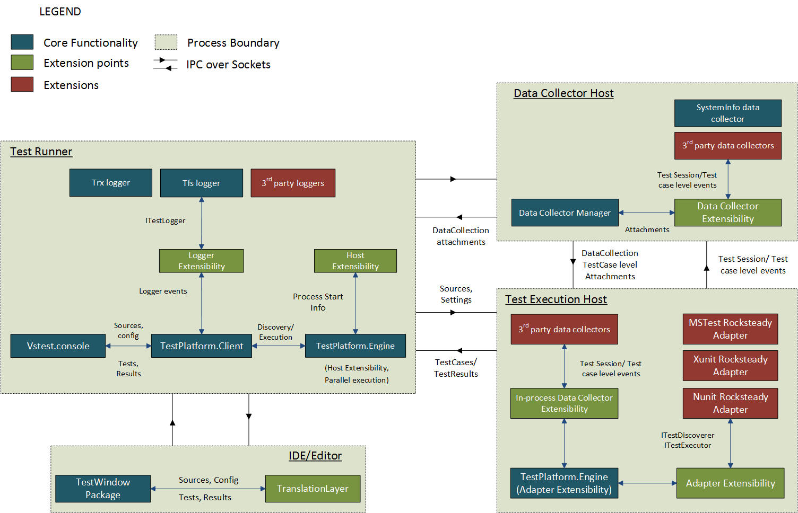
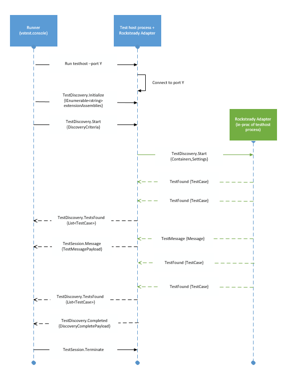

# 0001 Test Platform Architecture

## Summary
This document outlines the architecture of the Visual Studio Test Platform. It
covers the core components and the runner.

## Motivation
The test platform should help the developer through out [testing life
cycle][testplatform-concept-blog]. In terms of **acquisition**, the test
platform may provide a test runner which is available in key operating systems
and devices.

Based on test strategy of a product, tests are grouped into various categories
as per semantics (the product area they validate), or the phase they run
(Developer Machine, Continuous Integration or Continuous Deployment). Test
platform should allow **selection** of tests. Various aspects of test execution
may need to be **configurable** and shared across a team. During test execution,
diagnostics from the product should be available as **reporting**. The reporting
and collection of diagnostics data may be extensible to support coverage,
loggers, analytics and so on.

The platform should provide an extensibility model for test frameworks (and
language runtimes). A developer acquainted with the aspects of test platform can
use the same set of operations (test filtering, test execution, reporting)
irrespective of the test framework (or language runtime) of the test.

[testplatform-concept-blog]: https://blogs.msdn.microsoft.com/visualstudioalm/2016/07/25/evolving-the-visual-studio-test-platform-part-1

## Detailed Design

The overall architecture of the test platform is detailed in the block diagram
below with all the extensibility points colored in green. 

This architecture has four major components:

1. **Test Runner** is the command line entrypoint to test platform
   (`vstest.console`).
2. **Test Execution Host** is an architecture and framework specific process
   that actually loads the test container and executes tests.
3. **Data Collector Host** process hosts various test execution data
   listeners.
4. **IDE/Editor** process is used by developer for Edit/Build the application
   and trigger test runs.

We will describe each component in the following sections.

### Test Runner
Test runner is the primary entry point to the test platform. It takes a test
container with a set of configuration settings as input. The language runtime,
architecture, framework for test execution are inferred from the settings. Based
on these parameters, it spawns a **Test Execution Host** process.

Test platform separates the test execution from the test runner for the
following reasons:

* Tests can target any language runtime. E.g. .NET, Javascript, Python etc.
* Tests can target a specific version of the runtime. E.g. .NET 4.6 or .NET
  Standard 1.4
* Tests can target a specific platform architecture. E.g. x64 or x86
* Tests can target a different device
* Test runner (or the loggers) need to capture details even in case test
  execution host terminates abnormally
* Test execution can be ported to newer devices/platforms/runtimes without any
  impact on test runner

An example: `vstest.console` can be `net46` but run tests targeting
`netcoreapp1.0`. The tests are loaded in a different process (`dotnet.exe`)
which hosts the `netcoreapp1.0` CLR runtime. If user upgrades their test project
to `netcoreapp2.0`, the tests will continue to run.

**Host extensibility** allows developers to author custom test execution hosts.
One of the primary use case for this is running tests on a device. E.g. in case
of running tests against a Universal Windows device, the test host is launched
on a Windows Phone device. The test case and run settings are passed on to the
test host using a JSON over Sockets protocol.

Using the **Logger extensibility** feature, an extension can listen to the *Test
Result* for each test case. It can also recieve a set of *Test Attachments*
generated during the test execution. E.g. Trx logger generates an xml report of
test results, elapsed time for the run etc. using this mechanism.

If data collectors are specified in the run settings, the **Data Collector
Host** is spawned. We will cover it in more details in another section below.

The test runner component loads host extensions and logger extensions in it's
process. Data collectors are not loaded in this process. The tests are also not
loaded here, it is completely agnostic to test runtime/platform.

### Test Execution Host
The test host connects to the test runner, and waits for commands to discover
and execute tests. Details of the protocol are available in [test discovery
protocol][] and [test execution protocol][] documents.

A test host is specific to the language runtime, version and platform architecture
of the test containers. E.g. `testhost.x86.exe` is the test host for a test
container (assembly) targeting .NET Framework 4.6, x86 architecture; where as
`testhost.exe` is spawned for .NET Framework 4.6, x64 architecture. The test
host for .NET Core is platform agnostic and is launched on the required
`dotnet.exe` (x86 or x64).

However the test host is agnostic of test framework. It has no knowledge of
*what* a Test Case or Test Suite is. It delegates the responsibility of
discovering and executing the tests to **Test Adapters**. An adapter understands
the intricacies of test framework. E.g. the NUnit adapter understands tests
authored in NUnit framework, it can discover and execute them.

**Adapter Extensibility** provides an extensible way for developers to plug in
an adapter for the test framework of their choice. An adapter needs to implement
a specific interface that is understood by the test host. [Test Adapter
Extensibility][test adapter extensibility] document covers this in more detail.

A Data Collector monitors the test execution and collects diagnostic,
performance, and other data for the code under test. If a data collector needs
to collect intrusive data, it may use the **In-Proc Data Collection
Extensibility** API for this. In-proc data collectors, as the name suggests, are
loaded within the test execution host. They can subscribe the test run and test
case level events.

We will discuss out of process data collectors in the next section.

[test discovery protocol]: 0002-Test-Discovery-Protocol.md
[test execution protocol]: 0003-Test-Execution-Protocol.md
[test adapter extensibility]: 0004-Adapter-Extensibility.md

### Data Collector Host
Out of process data collectors are hosted in the data collector host process.
Similar to in-proc data collector, these data collectors also receive test run
and test case level start/stop events. Usually the data collector starts/stops
monitoring in these event handlers. Further a data collector can generate
attachments which are available in the test results. E.g. a video data
collector can record a browser session while the test case is executing, it may
attach the recorded video to the test result (if the test case failed) for
further analysis by the user.

Data collectors are hosted in a separate process for several reasons:

1. Data collector may not be intrusive, it should not impact the test execution
   itself. E.g. a performance data collector may not be accurate if it runs
   within the execution process
2. The test host process can be of a totally different architecture, framework.
   However data collectors are usually generic. E.g. the video data collector
   should record videos for JS or .NET tests alike.

Data collector host process is spawned only if data collection is configured in
the test run settings.

Detailed design of a data collector is available in the [Data Collector
Protocol][data collector protocol] document.

[data collector protocol]: 0006-DataCollection-Protocol.md

### IDE/Editor
An IDE/Editor can connect to `vstest.console` over a JSON protocol. It invokes
the runner with a specific port to connect. Once connected, the runner can
receive commands to discover or execute tests. The Editor needs to specify a
test container for the run, and any `runsettings` as specified by user. The
runner returns list of discovered `TestCase` for discovery command. For test
execution it returns a list of `TestResult` objects.

The separation of `vstest.console` as a different process allows non .NET based
Editors to use test platform capabilities. Secondly, the runner process loads
several extensions (loggers, host extensions) at runtime; process isolation
allows flexibility for Editor to not load these extensions in-proc.

This protocol is documented in [Editor API Specification][editor protocol]
document.

[editor protocol]: 0007-Editors-API-Specification.md

### Flow: Test Runner - Test Host

1. A user would spawn an instance of the runner with a set of test containers
   and settings for the test session. 
2. The runner would then process those settings to figure out key decision
   parameters for the run some of which are:
	* The architecture the tests should run on.(x86/x64)
	* The framework that the tests are on.(Desktop Fx/Core Fx)
	* Data collectors if enabled.
	* Path to user specified extension assemblies.
3. It uses the architecture and framework specified to spawn an instance of a
   test host process that satisfies these settings.
4. The runner also starts an instance of a TCP server to communicate with the
   test host process. 
5. After the test host launches it sets up a client connection with the runner. 
6. The runner would then send through the test containers with the user
   specified settings to the test host process.
7. The test host process performs the requested operation - either
   discovery/execution - and returns back the results in batches to the runner.
8. The test host signals an operation end to the runner which then notifies the
   loggers and bails out.

The protocol between the runner and the test host for discovery and execution is
detailed below. The interaction between the runner, test host and data collector
is detailed in a different document.

#### Discovery:	

1. After launching the test host process as detailed above, the runner sends a
   TestDiscovery.Initialize message with the full path to extension assemblies
   as an `IEnumerable<string>`. The test host then uses this to load the
   extensions before hand. This is an optional step and will not be sent if
   there are no additional extensions but the default.
2. The runner then sends a TestDiscovery.Start message with a
   [DiscoveryPayload][] which contains the test containers and the session level
   settings.
3. The TestPlatform.Engine component in test host process invokes the loaded
   adapters with these containers to discover tests.
4. When the adapter finds a test it notifies the TestPlatform.Engine which
   caches these test cases.
5. When the maximum cache size is hit or on a cache timeout the engine passes on
   a list of test cases in a `TestDiscovery.TestsFound` message as a
   `List<TestCase>`
6. The adapter can also notify the TestPlatform.Engine of any errors/warnings
   during discovery via a message. This messages are then sent to the runner as
   a TestSession.Message with a [TestMessagePayload][] This is an optional
   message.
7. On discovery completion the adapter notifies the TestPlatform.Engine which
   then sends a TestDiscovery.Completed message to the runner with a
   [DiscoveryCompletePayload][]
8. On receiving a discovery complete from the test host the runner then ends the
   communication with a TestSession.Terminate.
9. On receiving a terminate message the test host process cleanly exits.
	
[DiscoveryPayload]: ./src/Microsoft.TestPlatform.ObjectModel/Client/DiscoveryCriteria.cs
[TestMessagePayload]: ./src/Microsoft.TestPlatform.CommunicationUtilities/Messages/TestMessagePayload.cs
[DiscoveryCompletePayload]: ./src/Microsoft.TestPlatform.CommunicationUtilities/Messages/DiscoveryCompletePayload.cs

#### Execution:

1. After launching the test host process as detailed above the runner sends a
   TestExecution.Initialize message with the full path to extension assemblies
   as an `IEnumerable<string>`. The test host then uses this to load the
   extensions needed for execution before hand. This is an optional step and
   will not be sent if there are no additional extensions but the default.
2. The runner then sends a TestExecution.StartWithSources message with a
   [TestRunCriteriaWithSources][] which contains the test containers and the
   session level settings.
3. The TestPlatform.Engine component in test host process invokes the loaded
   adapters with these containers to execute tests.
4. The adapter notifies the TestPlatform.Engine of a test case start, test
   result and a test case end. It maintains the test results received in a
   cache.
5. When the maximum cache size is hit or on a cache timeout the
   TestPlatform.Engine passes on a list of test results in a
   TestExecution.TestResults message as a [TestRunStatsPayload][]
6. The adapter can also notify the TestPlatform.Engine of any errors/warnings
   during execution via a message. This messages are then sent to the runner as
   a TestSession.Message with a [TestMessagePayload][]. This is an optional
   message.
7. On execution completion the adapter notifies the engine which then sends a
   TestExecution.Completed message to the runner with a [TestRunCompletePayload][].
8. On receiving a execution complete from the test host the runner then ends the
   communication with a TestSession.Terminate.
9. On receiving a terminate message the test host process cleanly exits.

[TestRunCriteriaWithSources]: ./src/Microsoft.TestPlatform.CommunicationUtilities/ObjectModel/TestRunCriteriaWithSources.cs
[TestRunStatsPayload]: ./src/Microsoft.TestPlatform.CommunicationUtilities/Messages/TestRunStatsPayload.cs
[TestMessagePayload]: ./src/Microsoft.TestPlatform.CommunicationUtilities/Messages/TestMessagePayload.cs
[TestRunCompletePayload]: ./src/Microsoft.TestPlatform.CommunicationUtilities/Messages/TestRunCompletePayload.cs

<!--The exact set of switches the vstest.console runner supports is listed here([Todo] add link here.))--> 

#### Note:
All IPC within the test platform is via sockets and json. 
