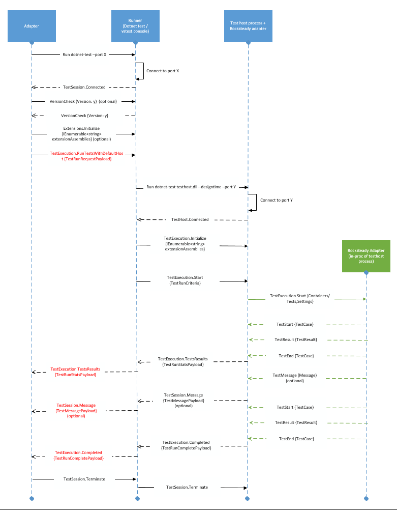
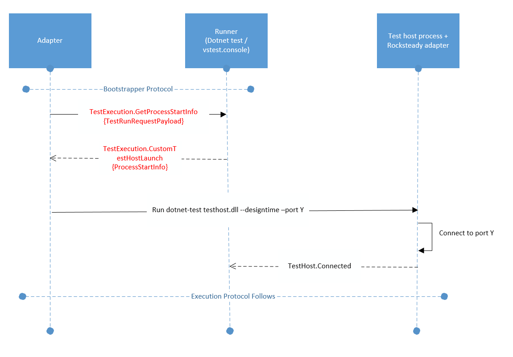

# 0003 Test Execution Protocol

## Summary
This note details the protocol improvements in the new dotnet-test integration with IDE's. The focus will be more on the delta with the older protocol and the breaking changes.

## Motivation
These protocol changes provides the following improvements to dotnet-test:
* Ability to accept multiple containers
* Container level parallelization
* Consistent experience with the capabilities that vstest.console provides - Rocksteady adapter and Logger extensibility.

## Detailed Design

### Terminology
* **IDE adapter (existing dotnet-test)** : Component that listens to messages from dotnet-test and populates the IDE with tests discovered or test results. For VS IDE this is the projectK Adapter.
* **TestRunner**: The test framework specific runner that discovers/executes tests in a container for that framework. This is dotnet-test-mstest / dotnet-test-xunit / dotnet-test-nunit.
* **Dotnet-test/vstest.console(Runner)**: Orchestrator of discovery or execution operations with one or more test host processes which then communicates back to the adapter the test cases or test results received from the test host process. This component also hosts the logger functionality which logs the test results in a file or posts them to a server.
* **Test host process**: The host process that loads the rocksteady engine which then calls into the Rocksteady adapters to discover/execute tests. This component communicates back to the client (dotnet-test or vstest.console.exe) with the set of tests discovered or test results.
* **Rocksteady adapter**: The framework specific adapter that discovers or executes tests of that framework. These adapters are invoked in-proc by the rocksteady engine via the ITestDiscoverer and ITestExecutor interfaces.
* **TPV2**: The new cross-plat test platform which encompasses the Runner, test host and the adapters. This is the framework that enables users to run tests.

### Protocol
This is the existing dotnet-test integration with IDEs:

Reference: https://github.com/dotnet/cli/blob/rel/1.0.0/Documentation/dotnet-test-protocol.md#test-execution

Here is what the changed wire protocol looks like after TPV2 integrates with dotnet-test:

And this protocol helps one launch a custom host or perform debugging:

### Breaking changes for Adapter(IDE)
1. The object model used via the wire protocol will change from using [Microsoft.Extensions.Testing.Abstractions.Test](https://github.com/dotnet/cli/blob/rel/1.0.0/src/Microsoft.Extensions.Testing.Abstractions/Test.cs) and [Microsoft.Extensions.Testing.Abstractions.TestResult](https://github.com/dotnet/cli/blob/rel/1.0.0/src/Microsoft.Extensions.Testing.Abstractions/TestResult.cs) to [Microsoft.VisualStudio.TestPlatform.ObjectModel.TestCase](./src/Microsoft.TestPlatform.ObjectModel/TestCase.cs) and [Microsoft.VisualStudio.TestPlatform.ObjectModel.TestResult](./src/Microsoft.TestPlatform.ObjectModel/TestCase.cs) appropriately.
2. The IDE adapter would now be sending the test Containers along with test platform settings to dotnet-test.
3. The IDE adapter would now receive test results in a batch in the [TestRunStatsPayload](./src/Microsoft.TestPlatform.CommunicationUtilities/Messages/TestRunStatsPayload.cs) as opposed to a test start, test result and a test end earlier. The TestRunStatsPayload will also have the statistics of passed/failed/skipped tests so far along with list of tests currently being run.
4. The IDE Adapter would now receive a [TestRunCompletePayload](./src/Microsoft.TestPlatform.CommunicationUtilities/Messages/TestRunCompletePayload.cs) with TestExecution.Completed which would have the run statistics along with the results for last set of tests run.

### Breaking Changes for Frameworks
1. TestRunner would cease to exist. Framework writers would have to port their Rocksteady adapters to Core CLR to support all .NET Core scenarios.

### New Flow for Run Tests:
1. After the optional version check,  the IDE adapter can choose to optionally send paths to extensions it wants to initialize the test platform with.
2. The IDE adapter then sends either a TestExecution.RunTestsWithContainersOnDefaultHost (or) TestExecution.RunTestsWithTestsOnDefaultHost with a [TestRunRequestPayload](./src/Microsoft.TestPlatform.VsTestConsole.TranslationLayer/Payloads/TestRunRequestPayload.cs) that contains containers (or) tests respectively.
3. dotnet-test would then spawn an instance of the default test host process for the configuration specified. 
4. dotnet-test then sends across the extensions if the IDE adapter has specified any, followed by the containers/test cases to run tests on. 
5. The test host then invokes the Rocksteady adapter with the containers/tests to run via the ITestExeuctor.RunTests entry point. 
6. The Rocksteady adapter runs each test and calls back to the test host when a test starts, when a test result is received and when a test ends.
7. The test host process maintains a cache of the test results received above.
8. When the cache size is met the test host process sends a TestExecution.TestResults with a [TestRunStatsPayload](./src/Microsoft.TestPlatform.CommunicationUtilities/Messages/TestRunStatsPayload.cs), which contains the cached results in a batch, to dotnet-test which then forwards it to the IDE adapater.
9. Optionally the IDE adapter may also receive a TestSession.Message with a [TestMessagePayload](./src/Microsoft.TestPlatform.CommunicationUtilities/Messages/TestMessagePayload.cs) notifying of any issues during execution.
10. When execution is complete, the test host process sends a TestExecution.Completed message to dotnet-test with a [TestRunCompletePayload](./src/Microsoft.TestPlatform.CommunicationUtilities/Messages/TestRunCompletePayload.cs) which contains the run statistics along with the results for the last set of tests run.
11. dotnet-test then forwards this message to the IDE adapter.
12. Once the IDE adapter is done, it sends dotnet-test a TestSession.Terminate which will cause dotnet-test to shutdown.

### New Flow for Debug Tests/Custom test host process:
This flow would have the same protocol to bootstrap the test platform which is essentially #1 in the default flow above. Here is the sequence of steps after the initialization phase:

1. The IDE adapter sends a TestExecution.GetProcessStartInfo with a [TestRunRequestPayload](./src/Microsoft.TestPlatform.VsTestConsole.TranslationLayer/Payloads/TestRunRequestPayload.cs) that contains the container/tests it wants to execute.
2. dotnet-test then reverts back to the IDE adapter with a TestExecution.CustomTestHostLaunch with a [ProcessStartInfo](./src/Microsoft.TestPlatform.ObjectModel/TestProcessStartInfo.cs) payload which has the process start info of the default test host. As part of the arguments, we send a port that the test host should connect to communicate with dotnet-test.
3. At this point, the adapter can launch the test host process (and attach to it for debugging if it chooses to).
4. Once the test host starts, it sends dotnet-test a handshake TestHost.Connected message that indicates it is ready to receive commands.

After these set of actions the protocol is the same as the default flow above, which is essentially from Step #4 above.
	
### Notes:
1. Since TPV2 supports execution on multiple containers with a bunch of settings the Adapter can now pass in the containers as a List<string> to dotnet-test. Dotnet-test would then orchestrate among (multiple) test host processes and update the Adapter with the test results.
