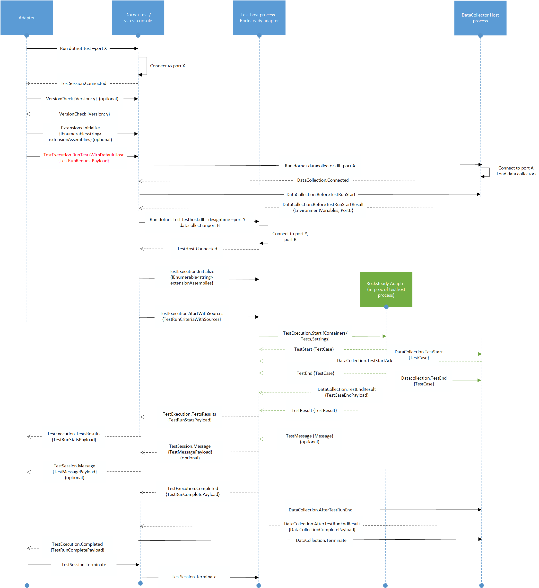
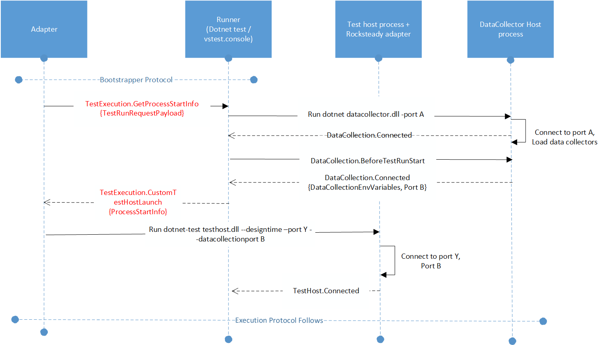

# 006 DataCollection Protocol

## Summary
This note details the protocol for out of process data collection. 

## Motivation
This note provides the following : 
* Protocol details for interaction between data collector host process and test execution host process.
* Data collection extensibility.

## Detailed Design

### Terminology
* **IDE adapter**: Component that listens to messages from dotnet-test and populates the IDE with tests discovered or test results.
* **Dotnet-test/vstest.console(Runner)**: Orchestrator of discovery or execution operations with one or more test host processes which then communicates back to the adapter the test cases or test results received from the test host process. This component also hosts the logger functionality which logs the test results in a file or posts them to a server.
* **Test host process**: The host process that loads the rocksteady engine which then calls into the Rocksteady adapters to discover/execute tests. This component communicates back to the client (dotnet-test or vstest.console.exe) with set of tests discovered or test results.
* **Rocksteady adapter**: The framework specific adapter that discovers or executes tests of that framework. These adapters are invoked in-proc by the rocksteady engine via the ITestDiscoverer and ITestExecutor interfaces.
* **TP V2**: The new cross-plat test platform which encompasses the Runner, test host and the adapters. This is the framework that enables users to run tests.
* **DataCollector host proces**: The host process that loads the data collector(s), when specified in test run settings, coordinates with test execution host process to get the test execution events, sends the events to loaded data collectors and finally, send the results to dotnet-test after test execution is completed.

### Protocol
Here is how the wire protocol for TP v2 looks like :

And this is how the wire protocol looks like with custom host:

## Flow for datacollection for Run Tests:
1. After the Adapter initiates test execution, dotnet-test checks whether data collectors are configured in test run settings. If yes, it spawns of datacollector host process.
2. Datacollector host process then loads and initializes all the data collectors.
3. Datacollector host process also opens another port B to be used for communicating with test execution host process.
4. Datacollector host process then returns environment variables, if any, as specified by datacollectors and port B back to dotnet-test process.
5. dotnet-test spawns of test execution host process with environment variables and passes port B.
6. Test execution host process then connects to port B.
7. Test execution host process send events : TestCaseStart and TestCaseEnd, on receiving them from Rocksteady adapter for every testcase.
8. On receiving TestCaseStart, datacollector host process responds by sending acknowledgement for TestCaseStart event.
8. On receiving TestCaseEnd, datacollector host process responds by sending attachments, if any, as generated by datacollectors.
9. On completion of test execution, test-host sends DataCollection.AfterTestRunEnd.
10. Datacollector host process returns the attachments, if any, as generated by datacollectors. 
11. dotnet-test sends DataCollection.Terminate message to datacollector host process.
12. Attachments returned by data collector host process is shared by loggers.

## Flow for datacollection for Debug Tests/Custom test host process:
1. After the Adapter initiates TestExecution.GetProcessStartInfo, dotnet-test checks whether datacollectors are configured in test run settings. If yes, it spawns of datacollector host process.
2. Datacollector host process then loads and initializes all the data collectors.
3. Datacollector host process also opens another port B for communicating with test execution host process.
4. Datacolector host process then returns environment variables (if any, as requested by datacollectors) and port B (if testcase events are subscribed) back to dotnet-test process.
5. Envionment variables and port B info is passed back to Adapter along with ProcessStartInfo of custom test host process.
6. At this point, the adapter can launch the test host process (and attach to it for debugging if it chooses to).

After the test host process is spawned, the protocol is the same as the default flow above, which is essentially from Step #6 above.
